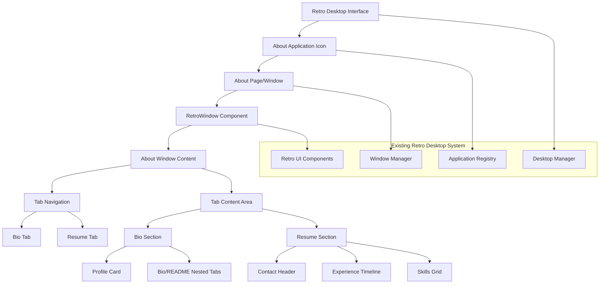

# Design Document

## Overview

The About Page is a new page within the existing Rem's World retro desktop interface that presents personal and professional information in an authentic Mac OS desktop window format. The page will be built as part of the existing retro desktop system, creating new components that follow the established retro UI patterns while incorporating content structure and information inspired by the reference Bio and Resume components.

The design integrates with the existing retro desktop architecture, utilizing the established window management system, retro UI component library, and desktop application framework. The page will be accessible through the desktop interface and maintain consistency with the overall retro aesthetic while providing comprehensive information about Remington's background, skills, and professional experience.

## Architecture

### High-Level Architecture



### Technology Stack

- **Frontend Framework**: Next.js 14 with App Router
- **Language**: TypeScript
- **Styling**: Tailwind CSS with retro theme extensions
- **UI Components**: Radix UI primitives with custom retro styling
- **Backend**: Convex for storage and data management
- **Internationalization**: Existing language context system
- **State Management**: React hooks and context

### Design Principles

1. **Component Reuse**: Maximize reuse of existing Bio and Resume components
2. **Retro Aesthetic**: Maintain authentic Mac OS window styling throughout
3. **Responsive Design**: Ensure functionality across different screen sizes
4. **Performance**: Optimize for fast loading and smooth interactions
5. **Accessibility**: Maintain keyboard navigation and screen reader support

## Components and Interfaces

### About Page Component

The main page component that orchestrates the retro window layout and tab management.

```typescript
interface AboutPageProps {
  // No props needed - uses existing context systems
}

interface AboutPageState {
  activeTab: "bio" | "resume";
  bioSubTab: "bio" | "readme";
}
```

### Retro Window Container

A wrapper component that provides the Mac OS window chrome and styling.

```typescript
interface RetroWindowContainerProps {
  title: string;
  children: React.ReactNode;
  className?: string;
}

interface WindowChrome {
  titleBar: React.ComponentType<TitleBarProps>;
  windowControls: React.ComponentType<WindowControlsProps>;
  windowFrame: React.ComponentType<WindowFrameProps>;
}
```

### Tab Navigation System

Manages the main tab switching between Bio and Resume sections.

```typescript
interface TabNavigationProps {
  activeTab: "bio" | "resume";
  onTabChange: (tab: "bio" | "resume") => void;
  tabs: TabDefinition[];
}

interface TabDefinition {
  id: string;
  label: string;
  icon?: React.ComponentType;
  disabled?: boolean;
}
```

### Bio Section Integration

Adapts the existing Bio component for the desktop window format.

```typescript
interface BioSectionProps {
  isActive: boolean;
  onSubTabChange: (subTab: "bio" | "readme") => void;
  activeSubTab: "bio" | "readme";
}

interface ProfileCardData {
  name: string;
  title: string;
  avatar: string;
  location: string;
  languages: string[];
  workAuth: string;
  socialLinks: SocialLink[];
  achievements: string[];
}
```

### Resume Section Integration

Adapts the existing Resume component for the desktop window format.

```typescript
interface ResumeSectionProps {
  isActive: boolean;
}

interface ResumeData {
  contactInfo: ContactInfo;
  summary: string;
  experience: JobExperience[];
  skills: SkillCategory[];
  certifications: string[];
  resumeUrl?: string;
}

interface JobExperience {
  title: string;
  company: string;
  duration: string;
  description: string;
  results: string[];
  responsibilities: string[];
  learning: string;
}
```

## Data Models

### Page State Management

```typescript
interface AboutPageState {
  activeTab: "bio" | "resume";
  bioSubTab: "bio" | "readme";
  isLoading: boolean;
  error?: string;
}

interface TabState {
  scrollPosition: number;
  lastVisited: Date;
  userInteractions: UserInteraction[];
}
```

### Content Data Structure

```typescript
interface AboutPageContent {
  bio: BioContent;
  resume: ResumeContent;
  metadata: PageMetadata;
}

interface BioContent {
  profile: ProfileData;
  narrative: string;
  readme: ReadmeContent;
}

interface ReadmeContent {
  intro: string;
  responsibilities: string[];
  quirks: string[];
  values: string[];
  help: string[];
  helpMe: string[];
  personal: string[];
  strategy: StrategyContent;
}

interface ResumeContent {
  header: ContactHeader;
  summary: string;
  experience: Experience[];
  skills: SkillCategories;
  certifications: Certification[];
}
```

### Styling and Theme Integration

```typescript
interface RetroTheme {
  window: WindowTheme;
  tabs: TabTheme;
  content: ContentTheme;
  colors: ColorPalette;
  typography: TypographyScale;
}

interface WindowTheme {
  chrome: ChromeStyles;
  shadow: ShadowStyles;
  border: BorderStyles;
  background: BackgroundStyles;
}
```

## Error Handling

### Error Boundary Implementation

```typescript
interface AboutPageErrorBoundary extends React.Component {
  state: {
    hasError: boolean;
    error?: Error;
    errorInfo?: React.ErrorInfo;
  };

  // Handles component crashes gracefully
  // Displays retro-styled error messages
  // Provides recovery options
}
```

### Error Types and Recovery

1. **Component Load Errors**: Graceful fallback when Bio/Resume components fail
2. **Data Loading Errors**: Handle Convex storage failures for images/files
3. **Internationalization Errors**: Fallback to default language content
4. **Responsive Layout Errors**: Maintain functionality across screen sizes

### Error Display Strategy

```typescript
interface ErrorDisplay {
  showRetroErrorDialog(error: Error, context: string): void;
  showLoadingFallback(component: string): React.ReactNode;
  showDataUnavailable(dataType: string): React.ReactNode;
}
```

## Testing Strategy

### Unit Testing

- **Component Testing**: Test About page component rendering and state management
- **Tab Navigation**: Test tab switching functionality and state persistence
- **Content Integration**: Test Bio and Resume component integration
- **Responsive Behavior**: Test layout adaptation across screen sizes

### Integration Testing

- **Component Interaction**: Test Bio and Resume component data flow
- **Language Switching**: Test internationalization integration
- **Convex Integration**: Test storage and data retrieval functionality
- **Theme Integration**: Test retro styling consistency

### Visual Testing

- **Retro Aesthetic**: Ensure consistent Mac OS window styling
- **Tab Transitions**: Test smooth tab switching animations
- **Responsive Design**: Visual consistency across breakpoints
- **Component Adaptation**: Ensure existing components fit window format

### Accessibility Testing

- **Keyboard Navigation**: Tab navigation and content accessibility
- **Screen Reader Support**: Proper ARIA labels and semantic structure
- **Focus Management**: Logical tab order and focus indicators
- **Color Contrast**: Maintain readability within retro color scheme

## Performance Considerations

### Optimization Strategies

1. **Component Lazy Loading**: Load Bio/Resume components on demand
2. **Image Optimization**: Optimize avatar and other images for web
3. **Bundle Splitting**: Separate About page code from main bundle
4. **State Optimization**: Efficient tab switching without re-renders
5. **Memory Management**: Clean up resources when tab is inactive

### Loading Strategy

```typescript
interface LoadingStrategy {
  preloadCriticalContent(): Promise<void>;
  lazyLoadTabContent(tab: string): Promise<React.ComponentType>;
  optimizeImageLoading(images: string[]): Promise<void>;
  cacheComponentData(component: string, data: any): void;
}
```

### Performance Monitoring

- **Tab Switch Performance**: Monitor tab transition smoothness
- **Content Load Times**: Track Bio/Resume component loading
- **Memory Usage**: Monitor component memory consumption
- **Bundle Size**: Track About page bundle impact

## Responsive Design Strategy

### Breakpoint Strategy

```typescript
interface ResponsiveBreakpoints {
  mobile: "320px - 768px";
  tablet: "768px - 1024px";
  desktop: "1024px+";
}

interface ResponsiveLayout {
  mobile: MobileLayoutConfig;
  tablet: TabletLayoutConfig;
  desktop: DesktopLayoutConfig;
}
```

### Mobile Adaptations

1. **Tab Navigation**: Convert to accordion or stacked layout on mobile
2. **Profile Card**: Adapt to horizontal layout for smaller screens
3. **Content Sections**: Stack vertically with appropriate spacing
4. **Window Chrome**: Simplify window styling for touch interfaces

### Layout Flexibility

```typescript
interface LayoutConfig {
  windowMaxWidth: string;
  contentPadding: ResponsivePadding;
  tabHeight: ResponsiveHeight;
  profileCardLayout: "vertical" | "horizontal" | "adaptive";
}
```

## Integration Points

### Retro Desktop System Integration

1. **Window Manager**: Integrate with existing window management system for proper window lifecycle
2. **Application Registry**: Register About page as a desktop application with proper metadata
3. **Retro UI Components**: Use existing RetroWindow, RetroButton, and other retro-styled components
4. **Desktop Manager**: Ensure About application appears and behaves like other desktop applications

### Content Structure Integration

1. **Reference Components**: Use the provided Bio and Resume components as content and structure reference
2. **Data Modeling**: Create new data structures based on the content patterns from reference components
3. **Styling Patterns**: Adapt the styling approaches from reference components to fit retro aesthetic
4. **Content Organization**: Follow the tabbed interface pattern demonstrated in reference components

### Navigation Integration

- **Desktop Application**: About page accessible as a desktop application icon
- **Window System**: Integrates with existing window management (minimize, maximize, close, drag, resize)
- **Application Lifecycle**: Follows established patterns for desktop application behavior

## Security Considerations

### Content Security

- **Input Sanitization**: Ensure all content from components is properly sanitized
- **XSS Prevention**: Maintain existing security measures for dynamic content
- **Image Security**: Secure handling of avatar and other images from Convex storage

### Data Protection

- **Personal Information**: Secure handling of contact and personal information
- **Storage Security**: Maintain existing Convex security for file storage
- **Client-Side Security**: Ensure no sensitive data exposure in browser

## Deployment Considerations

### Build Optimization

- **Static Generation**: Pre-render About page for optimal performance
- **Asset Optimization**: Optimize images and fonts for retro styling
- **Bundle Analysis**: Monitor impact on overall application bundle size

### SEO and Metadata

```typescript
interface SEOConfig {
  title: string;
  description: string;
  keywords: string[];
  openGraph: OpenGraphConfig;
  structuredData: StructuredDataConfig;
}
```

### Performance Monitoring

- **Core Web Vitals**: Monitor page loading and interaction metrics
- **User Experience**: Track tab usage and engagement patterns
- **Error Tracking**: Monitor component integration issues in production
