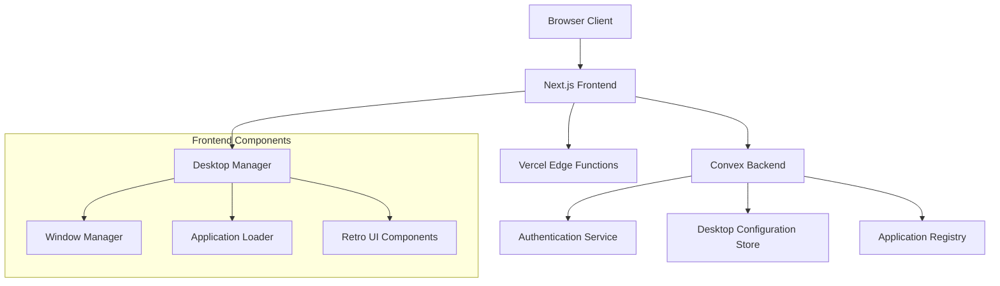

# Design Document

## Overview

Rem's World is a web application that recreates the nostalgic experience of classic Mac OS X/Apple Lisa desktop environments. The system provides a modular, Windows-like UI framework where applications, links, and projects can be dynamically added and managed. Built on Next.js 14 with TypeScript, the application leverages Vercel for deployment and Convex for backend services including authentication and data persistence.

The design emphasizes authentic retro aesthetics while maintaining modern web standards for performance, accessibility, and responsive design. The modular architecture allows for easy extension and customization of desktop applications and components.

## Architecture

### High-Level Architecture



### Technology Stack

- **Frontend Framework**: Next.js 14 with App Router
- **Language**: TypeScript
- **Styling**: Tailwind CSS with custom retro theme
- **UI Components**: Radix UI primitives with retro styling
- **Backend**: Convex (real-time database and authentication)
- **Deployment**: Vercel
- **State Management**: React hooks with Convex real-time subscriptions

### Core Architectural Principles

1. **Modular Application System**: Applications are self-contained components that can be dynamically loaded
2. **Persistent State**: Desktop configuration and window states persist across sessions
3. **Real-time Synchronization**: Changes sync across devices using Convex real-time capabilities
4. **Responsive Retro Design**: Maintains authentic retro aesthetics across all screen sizes
5. **Type Safety**: Full TypeScript implementation for reliability and developer experience

## Components and Interfaces

### Desktop Manager Component

The central orchestrator that manages the desktop environment, applications, and user interactions.

```typescript
interface DesktopManagerProps {
  userId?: string;
  initialConfig?: DesktopConfiguration;
}

interface DesktopConfiguration {
  wallpaper: WallpaperConfig;
  applications: ApplicationConfig[];
  windowStates: WindowState[];
  preferences: UserPreferences;
}
```

### Window Manager System

Handles window lifecycle, positioning, layering, and interactions with authentic retro window chrome.

```typescript
interface WindowManager {
  openWindow(config: WindowConfig): void;
  closeWindow(windowId: string): void;
  minimizeWindow(windowId: string): void;
  maximizeWindow(windowId: string): void;
  focusWindow(windowId: string): void;
  moveWindow(windowId: string, position: Position): void;
  resizeWindow(windowId: string, size: Size): void;
}

interface WindowConfig {
  id: string;
  title: string;
  component: React.ComponentType;
  initialPosition: Position;
  initialSize: Size;
  resizable: boolean;
  minimizable: boolean;
  maximizable: boolean;
}
```

### Application Registry

Dynamic system for registering and loading desktop applications with metadata and lazy loading support.

```typescript
interface ApplicationRegistry {
  registerApplication(app: ApplicationDefinition): void;
  getApplication(id: string): ApplicationDefinition | null;
  listApplications(): ApplicationDefinition[];
  loadApplication(id: string): Promise<React.ComponentType>;
}

interface ApplicationDefinition {
  id: string;
  name: string;
  icon: IconConfig;
  category: ApplicationCategory;
  component: () => Promise<React.ComponentType>;
  defaultWindowConfig: Partial<WindowConfig>;
  permissions: Permission[];
}
```

### Retro UI Component Library

Authentic retro-styled components that maintain the classic Mac OS aesthetic.

```typescript
interface RetroUIComponents {
  RetroWindow: React.ComponentType<RetroWindowProps>;
  RetroButton: React.ComponentType<RetroButtonProps>;
  RetroMenuBar: React.ComponentType<RetroMenuBarProps>;
  RetroDialog: React.ComponentType<RetroDialogProps>;
  RetroIcon: React.ComponentType<RetroIconProps>;
  RetroScrollbar: React.ComponentType<RetroScrollbarProps>;
}
```

## Data Models

### User Profile and Preferences

```typescript
interface UserProfile {
  id: string;
  email: string;
  displayName: string;
  avatar?: string;
  createdAt: Date;
  lastLoginAt: Date;
}

interface UserPreferences {
  theme: "classic" | "dark" | "custom";
  wallpaper: WallpaperConfig;
  soundEffects: boolean;
  animations: boolean;
  gridSnap: boolean;
  autoSave: boolean;
}
```

### Desktop Configuration

```typescript
interface DesktopState {
  userId: string;
  applications: DesktopApplication[];
  windows: WindowState[];
  preferences: UserPreferences;
  lastModified: Date;
}

interface DesktopApplication {
  id: string;
  applicationId: string;
  position: Position;
  customName?: string;
  customIcon?: IconConfig;
  visible: boolean;
  order: number;
}
```

### Window State Management

```typescript
interface WindowState {
  id: string;
  applicationId: string;
  title: string;
  position: Position;
  size: Size;
  zIndex: number;
  isMinimized: boolean;
  isMaximized: boolean;
  isVisible: boolean;
  lastFocused: Date;
}

interface Position {
  x: number;
  y: number;
}

interface Size {
  width: number;
  height: number;
}
```

### Application Metadata

```typescript
interface ApplicationMetadata {
  id: string;
  name: string;
  description: string;
  version: string;
  author: string;
  category: ApplicationCategory;
  icon: IconConfig;
  screenshots: string[];
  permissions: Permission[];
  dependencies: string[];
}

type ApplicationCategory =
  | "productivity"
  | "entertainment"
  | "development"
  | "communication"
  | "utility"
  | "game";

type Permission = "storage" | "network" | "notifications" | "camera" | "microphone";
```

## Error Handling

### Error Boundary Implementation

```typescript
interface ErrorBoundaryState {
  hasError: boolean;
  error?: Error;
  errorInfo?: ErrorInfo;
}

class DesktopErrorBoundary extends React.Component<
  React.PropsWithChildren<{}>,
  ErrorBoundaryState
> {
  // Catches application crashes and displays retro-styled error dialogs
  // Provides recovery options and error reporting
}
```

### Error Types and Recovery

1. **Application Load Errors**: Graceful fallback when applications fail to load
2. **Network Errors**: Offline mode with local state preservation
3. **Authentication Errors**: Seamless re-authentication flow
4. **State Corruption**: Automatic state recovery and backup restoration
5. **Window Management Errors**: Safe window state reset and recovery

### Error Reporting and Logging

```typescript
interface ErrorReporter {
  reportError(error: Error, context: ErrorContext): void;
  reportPerformanceIssue(metrics: PerformanceMetrics): void;
  reportUserFeedback(feedback: UserFeedback): void;
}

interface ErrorContext {
  userId?: string;
  applicationId?: string;
  windowId?: string;
  userAgent: string;
  timestamp: Date;
  stackTrace: string;
}
```

## Testing Strategy

### Unit Testing

- **Component Testing**: Jest + React Testing Library for all UI components
- **Hook Testing**: Custom hooks for window management and state persistence
- **Utility Testing**: Pure functions for position calculations and state management
- **Type Testing**: TypeScript strict mode with comprehensive type coverage

### Integration Testing

- **Window Management**: Multi-window interactions and state synchronization
- **Application Loading**: Dynamic application loading and error scenarios
- **Authentication Flow**: Convex authentication integration testing
- **Responsive Behavior**: Cross-device and screen size compatibility

### End-to-End Testing

- **Desktop Workflow**: Complete user journey from login to application usage
- **Persistence Testing**: State preservation across browser sessions
- **Performance Testing**: Window rendering and animation performance
- **Accessibility Testing**: Keyboard navigation and screen reader compatibility

### Visual Regression Testing

- **Retro Aesthetic Consistency**: Automated visual testing for UI components
- **Cross-browser Compatibility**: Consistent rendering across browsers
- **Responsive Design**: Visual consistency across screen sizes
- **Animation Testing**: Smooth transitions and retro-appropriate effects

## Performance Considerations

### Optimization Strategies

1. **Lazy Loading**: Applications loaded on-demand to reduce initial bundle size
2. **Virtual Windows**: Off-screen window content virtualization for memory efficiency
3. **State Optimization**: Efficient state updates using React's concurrent features
4. **Asset Optimization**: Retro graphics and fonts optimized for web delivery
5. **Caching Strategy**: Intelligent caching of application components and user data

### Memory Management

```typescript
interface MemoryManager {
  trackWindowMemory(windowId: string): void;
  cleanupInactiveWindows(): void;
  optimizeApplicationCache(): void;
  reportMemoryUsage(): MemoryReport;
}

interface MemoryReport {
  totalWindows: number;
  activeWindows: number;
  memoryUsage: number;
  cacheSize: number;
  recommendations: string[];
}
```

### Real-time Performance

- **Convex Subscriptions**: Efficient real-time data synchronization
- **Debounced Updates**: Smooth window dragging without excessive re-renders
- **Animation Optimization**: Hardware-accelerated CSS transforms for window movement
- **Bundle Splitting**: Code splitting by application and feature boundaries

## Security Considerations

### Authentication and Authorization

- **Convex Auth**: Secure authentication with session management
- **Application Permissions**: Granular permission system for desktop applications
- **Data Isolation**: User data isolation and privacy protection
- **Session Security**: Secure session handling and automatic logout

### Content Security

```typescript
interface SecurityManager {
  validateApplicationSource(appId: string): boolean;
  sanitizeUserContent(content: string): string;
  checkPermissions(appId: string, permission: Permission): boolean;
  auditUserActions(action: UserAction): void;
}
```

### Data Protection

- **Encryption**: Sensitive user data encryption at rest and in transit
- **Input Validation**: Comprehensive input sanitization and validation
- **XSS Prevention**: Content Security Policy and input sanitization
- **CSRF Protection**: Built-in Next.js CSRF protection mechanisms
