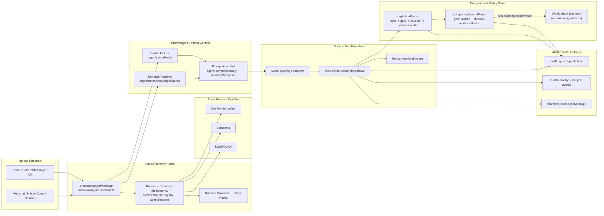

# Agent Runtime Architecture

See also: [Agent Topology Guide](./TOPOLOGY_GUIDE.md) for profile-level architecture choices and voice topology recommendations.
See also: [Architecture Reality Analysis (2026-03-26)](./ARCHITECTURE_REALITY_ANALYSIS_2026-03-26.md) for current-state inventory and migration recommendations.

## Goal

Move from a single monolithic runtime file to a composable model:

- Shared execution kernel in `convex/ai/agentExecution.ts` (routing, session, tool orchestration, safety envelope).
- Agent-specific runtime behavior in `convex/ai/agents/<agent>/runtimeModule.ts`.
- A lightweight registry to discover known module contracts from config.

## Current Layout

- `convex/ai/agents/types.ts`
  - Formal `AgentModule` interface + resolved module shape.
- `convex/ai/agents/runtimeModuleRegistry.ts`
  - Central registry and module resolution (`resolveAgentModuleFromConfig`).
- `convex/ai/agents/der_terminmacher/`
  - `runtimeModule.ts`, `prompt.ts`, `tools.ts`.
- `convex/ai/agents/samantha/`
  - `runtimeModule.ts`, `prompt.ts`, `policy.ts`, `tools.ts`.
- `convex/ai/agents/david_ogilvy/`
  - `runtimeModule.ts`, `prompt.ts`, `policy.ts`, `tools.ts`.

## Canonical Legal Front-Office Contract

The legal front-office runtime is intentionally role-separated:

1. `Clara` is the caller-facing concierge (`single_agent_loop`).
2. `Helena` is the back-office worker (`pipeline_router`).
3. `Compliance Evaluator` is the mandatory fail-closed gate (`evaluator_loop`) before external commitments.
4. `Quinn` remains onboarding/system-focused and is excluded from the legal back-office execution rail.
5. The legal execution sequence is `Clara -> structured_handoff_packet -> Helena -> Compliance Evaluator`.

## Integration Pattern

1. Keep `agentExecution.ts` as the shared orchestration kernel.
2. Resolve active module through registry in `processInboundMessage`.
3. Import and re-export module contracts/functions so external callers/tests stay stable.
4. Extract module-specific prompt/policy/tools helpers into dedicated files.
5. Add module tests in `tests/unit/ai/`.

## Mermaid Diagram

## Migration Rules

1. No behavior change in the first extraction (move code, keep signatures).
2. Add tests before/after each extraction.
3. Keep module contracts deterministic and config-driven.
4. Avoid cross-module imports between agent folders.
5. Prefer pure resolvers (no side effects) for agent-specific decisions.
