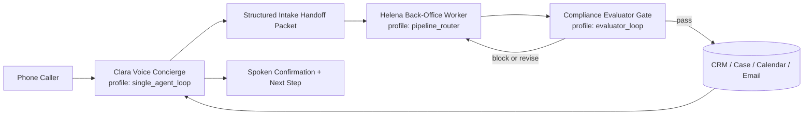

# Agent Architecture Reality Analysis (2026-03-26)

## Scope

This document translates product intent into codebase reality and proposes a migration path to a world-class lawyer front-office agent system.

Requested priorities addressed here:

1. Keep and harden `Quinn`, `Samantha`, `der_terminmacher`, `david_ogilvy`.
2. Keep ElevenLabs agents (`Clara`, `Veronica`, specialist team) with explicit active/inactive lifecycle.
3. Move to strict topology contracts with module-folder ownership where appropriate.
4. Improve the legal phone demo into a production-grade intake + back-office + compliance flow.

---

## 1) Current Reality (Codebase-Grounded)

### 1.1 Runtime modules currently in folder architecture

Current module folders under `convex/ai/agents/`:

- `der_terminmacher`
- `samantha`
- `david_ogilvy`

Current shared module registry and expected topology mapping:

- `convex/ai/agents/runtimeModuleRegistry.ts`
- `der_terminmacher_runtime_module_v1 -> pipeline_router`
- `one_of_one_samantha_runtime_module_v1 -> evaluator_loop`
- `david_ogilvy_runtime_module_v1 -> single_agent_loop`

Implication:

- The runtime-module architecture is real, but only complete for these three agents.

### 1.2 Quinn is present, but not module-folder aligned

Quinn/Mother is actively seeded and used via:

- `convex/onboarding/seedPlatformAgents.ts`
- `convex/platformMother.ts`

Observed behavior:

- Quinn template and Quinn worker are created/updated in `seedAll`.
- Quinn is foundational onboarding/system bot.
- Quinn is not represented as `convex/ai/agents/quinn/*` runtime module.

Implication:

- Your observation is correct: Quinn exists operationally, but is missing from the strict folder-based runtime module architecture.

### 1.3 Seed inventory is broad and ahead of runtime modularization

`convex/onboarding/seedPlatformAgents.ts` seeds many protected templates/workers, including:

- Quinn/Mother templates + workers
- Samantha templates + workers
- Personal operator and agency templates
- David Ogilvy template
- Telephony templates: Clara, Jonas, Maren, Anne Becker, Kanzlei MVP

Important detail:

- Only Samantha seed properties currently set `runtimeModuleKey` explicitly.
- Most seeded templates do not set explicit `runtimeTopologyProfile` / `runtimeTopologyAdapter`.

### 1.4 Topology enforcement exists, but many agents rely on heuristic inference

`convex/ai/agentExecution.ts` enforces runtime topology fail-closed. It resolves topology from:

1. explicit `runtimeTopologyProfile`
2. `runtimeModuleKey`
3. `templateRole` heuristics
4. `toolProfile` heuristics

If none resolve, it blocks execution.

Implication:

- Safety exists.
- But architecture strictness is mixed: many agents still run on inferred topology rather than declared contract.

### 1.5 ElevenLabs roster is richer than platform telephony runtime module model

Canonical ElevenLabs source-of-truth currently includes:

- `clara`, `maren`, `jonas`, `tobias`, `lina`, `kai`, `nora`, `samantha`, `veronica`, `anne_becker`
- Source: `apps/one-of-one-landing/scripts/elevenlabs/lib/catalog.ts`

Public rollout docs confirm:

- `Clara` as public entry
- star topology specialist routing
- `Veronica` as separate office receptionist
- Source: `docs/reference_projects/elevenlabs/implementation-eleven-agents-rollout/landing-demo-agents/README.md`

Platform deploy actions exist for:

- Clara, Jonas, Maren, Anne Becker, Kanzlei MVP
- Source: `convex/integrations/telephony.ts`

No equivalent platform template deploy action for Veronica was found.

### 1.6 Legal compliance capability is strong, but not yet represented as a first-class agent module

Existing compliance stack:

- `convex/complianceControlPlane.ts`
- `convex/ai/orgActionPolicy.ts`
- `convex/ai/agentExecution.ts` integration (kanzlei fail-closed/compliance checks)

You already have:

- fail-closed policy gates
- shadow-mode evaluator telemetry
- audit/event lifecycle

Implication:

- Compliance is implemented as control-plane + policy gating, not as an explicit standalone runtime module agent in `convex/ai/agents/*`.

---

## 2) Core Gaps to Close

1. Quinn architecture gap

- Quinn is critical but not module-folder aligned.

2. Topology declaration gap

- Many seeded templates rely on inference rather than explicit profile+adapter declarations.

3. Voice-to-backoffice handoff gap for legal wedge

- Legal flow exists as single-agent Kanzlei MVP and separate demo assets, but not yet as the target structured handoff pipeline (`voice concierge -> worker -> evaluator`).

4. Compliance role boundary gap

- Compliance is present but not surfaced as a clear agentic role boundary in the architecture docs/runtime module roster.

5. Lifecycle governance gap for specialist team

- Team specialists exist, but active/inactive lifecycle is not yet formalized as a first-class operating mode across catalogs, sync scripts, and deploy defaults.

6. Veronica boundary gap

- Veronica exists in ElevenLabs catalog/docs, but platform deployment and architecture governance are less explicit than Clara/Kanzlei paths.

---

## 3) Recommended Target Architecture

### 3.1 Production legal front-office flow

Recommendation:

- Keep `Clara` as caller-facing voice concierge.
- Use `Helena` as the separate back-office execution worker (not direct caller dialog orchestration).
- Keep compliance as mandatory evaluator gate before externally meaningful commitments.

### 3.2 Quinn + Helena separation (recommended)

Use two explicit roles:

1. `Quinn Onboarding` (existing mission)
2. `Helena Backoffice` (new legal/front-office execution mission)

Why:

- Avoid overloading one prompt/runtime with incompatible responsibilities.
- Keep onboarding quality while adding reliable back-office operations.

### 3.3 Active portfolio vs inactive preserved portfolio

Active target set:

- Quinn Onboarding
- Helena Backoffice
- Samantha
- Der Terminmacher
- David Ogilvy
- Clara
- Veronica
- Compliance Evaluator (runtime role; can still map to control-plane implementation)

Inactive-but-preserved set:

- Jonas, Maren, Tobias, Lina, Kai, Nora (retain assets, disable by default in deploy/sync pipelines)

---

## 4) Topology Assignment Recommendations

| Agent / Role | Current state | Recommended topology | Notes |
|---|---|---|---|
| Quinn Onboarding | seeded, no module folder | `single_agent_loop` (or `multi_agent_dag` if orchestration-heavy) | keep onboarding concise, strict handoff-out |
| Helena Backoffice (new separate agent) | not explicit yet | `pipeline_router` | primary worker for legal intake execution |
| Samantha | module exists | `evaluator_loop` | keep current runtime module contract |
| Der Terminmacher | module exists | `pipeline_router` | keep current runtime module contract |
| David Ogilvy | module exists | `single_agent_loop` | keep current runtime module contract |
| Clara (voice concierge) | telephony template + ElevenLabs assets | `single_agent_loop` | caller-facing only |
| Compliance Evaluator role | control-plane + policy today | `evaluator_loop` | gate Helena outputs before external commitments |
| Veronica | ElevenLabs catalog/docs | `single_agent_loop` | keep separate office-line boundary |
| Specialist team (Jonas/Maren/Tobias/Lina/Kai/Nora) | live demo assets | `single_agent_loop` each | park as inactive defaults; preserve assets |

---

## 5) Concrete Migration Plan (Deterministic)

### Phase A: Architecture contract hardening (immediate)

1. Add explicit `runtimeTopologyProfile` and `runtimeTopologyAdapter` to seeded template custom properties where missing.
2. Keep adapter/profile pair canonical via `resolveAgentRuntimeTopologyAdapter(profile)`.
3. Add contract tests asserting seeded templates have explicit topology declarations.

Outcome:

- Remove inference drift from critical agents.

### Phase B: Quinn module extraction

1. Create `convex/ai/agents/quinn/` with `runtimeModule.ts`, `prompt.ts`, `tools.ts`.
2. Move Quinn-specific runtime logic from monolithic paths into module-owned files without behavior change first.
3. Register Quinn in `runtimeModuleRegistry.ts` and align topology map.

Outcome:

- Quinn becomes first-class in the strict module architecture.

### Phase C: Legal handoff contract

1. Introduce a strict `structured_handoff_packet` contract (caller identity, urgency, deadlines, summary, requested next step, consent/disclosure evidence).
2. Clara produces packet; Helena Backoffice consumes packet.
3. Gate packet-driven actions through compliance evaluator before final commitments.

Outcome:

- Production-safe legal intake chain from call to back-office execution.

### Phase D: Compliance role formalization

1. Keep existing `complianceControlPlane`/`orgActionPolicy` core.
2. Add explicit architecture surface naming for compliance evaluator role.
3. Add explicit telemetry for `voice_handoff -> worker -> evaluator -> output` transitions.

Outcome:

- Compliance becomes visible and operable as a clear role boundary.

### Phase E: ElevenLabs lifecycle cleanup

1. Add lifecycle metadata (`active`/`inactive`) in catalog/sync layer.
2. Default deploy/sync suites to active subset (Clara, Veronica, selected legal set).
3. Keep inactive specialists fully versioned and testable via explicit opt-in suites.

Outcome:

- Keep assets without operational noise.

---

## 6) Recommendations on Open Questions

### Should Clara and back-office execution be one agent?

Recommendation: no for legal production.

- Keep caller conversation and operational execution as separate runtime responsibilities.
- This lowers risk, improves auditability, and keeps voice latency predictable.

### Should Helena be in the middle before compliance?

Recommendation: yes.

- Compliance is a gate/evaluator, not a full execution worker.
- Helena Backoffice should produce structured actions/artifacts; compliance should approve/block them.

### Can we use a fake-data org for development and evals?

Recommendation: yes, and do it now.

- Create a dedicated synthetic legal org fixture with realistic inbound scenarios.
- Use it as the canonical regression/eval environment for the new legal flow.
- We already have the idea of Schmidt & Partner in Clara elevenlabs setup, I will create the org in our platform, but I need you to generate the knowledge base! crm contacts, etc!!

---

## 7) Immediate Next Implementation Slice (high leverage)

1. Make topology declarations explicit in `seedPlatformAgents.ts` for Quinn, Clara, Kanzlei MVP, and other protected templates.
2. Create `convex/ai/agents/quinn/` (onboarding) and `convex/ai/agents/helena/` (back-office) as no-behavior-change extraction first.
3. Add `structured_handoff_packet` schema + unit tests.
4. Implement Clara->Helena handoff path for legal intake in one guarded lane.
5. Route Helena action plan through existing compliance gate and return outcome for voice confirmation.

This sequence gives architectural clarity first, then feature velocity without losing safety.
