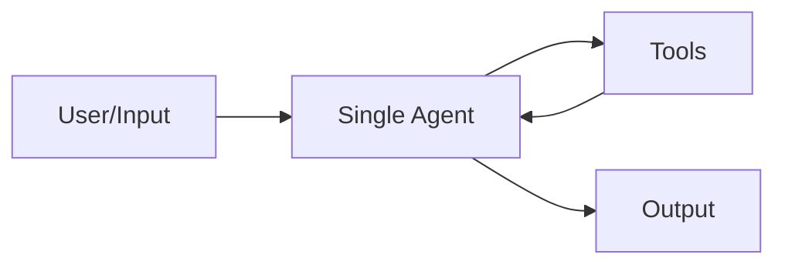
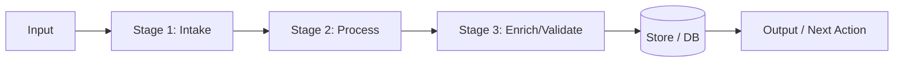
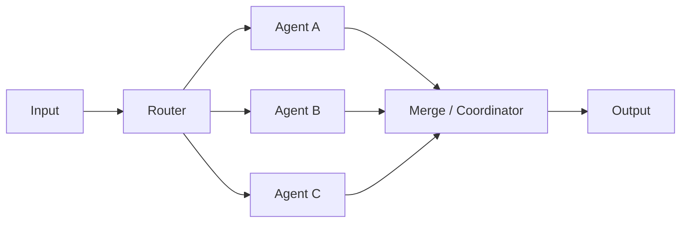
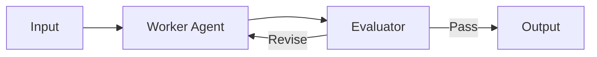
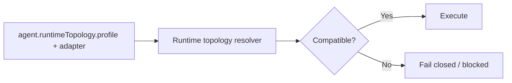
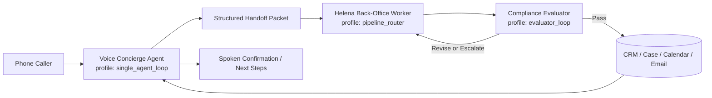

# Agent Topology Guide

## Purpose

Use this document to choose and label runtime topology per agent.

Topology is a contract, not a suggestion:

- `runtimeTopology.profile` (shape)
- `runtimeTopology.adapter` (adapter implementation)
- runtime enforcement in `agentExecution.ts` blocks incompatible combinations.

Canonical profiles in this repo:

- `single_agent_loop`
- `pipeline_router`
- `multi_agent_dag`
- `evaluator_loop`

## 1) Single Agent + Tools

Best when one agent can handle conversation and tool use directly.

- Strength: lowest orchestration overhead, fast to ship.
- Risk: one prompt has to do everything.
- Profile: `single_agent_loop`

## 2) Pipeline

Best when work is sequential and stage-based.

- Strength: deterministic stage boundaries.
- Risk: weaker at dynamic branching unless router logic is added.
- Profile: `pipeline_router`

## 3) Router (A/B/C Specialists)

Best when tasks need specialist selection.

- Strength: routes to best specialist per intent/capability.
- Risk: more routing complexity and trace requirements.
- Profile: `multi_agent_dag` (or `pipeline_router` for simpler route chains)

## 4) Evaluator Loop

Best for high-trust, fail-closed, quality-gated outputs.

- Strength: explicit quality/compliance gate.
- Risk: extra latency and potential loop churn.
- Profile: `evaluator_loop`

## Topology Labeling Rules

Each agent package/spec must declare exactly one topology profile and matching adapter.

Contract alignment to keep deterministic behavior:

- `single_agent_loop` <-> `single_agent_loop_adapter_v1`
- `pipeline_router` <-> `pipeline_router_adapter_v1`
- `multi_agent_dag` <-> `multi_agent_dag_adapter_v1`
- `evaluator_loop` <-> `evaluator_loop_adapter_v1`

## Recommended Voice Architecture (Law Firm Front Desk)

Recommendation: split voice conversation and back-office execution into separate agents, with explicit handoff.

Why:

- Voice interaction optimizes for low-latency turn-taking and caller experience.
- Back-office execution optimizes for correctness, tool orchestration, and auditability.
- Legal intake requires high-trust compliance checks before downstream actions.

Proposed topology composition:

- Voice Concierge: `single_agent_loop`
- Work Executor: `pipeline_router`
- Compliance/Quality Gate: `evaluator_loop`
- Optional specialist fanout (billing/conflict/calendar): `multi_agent_dag`

Canonical legal role boundary contract:

1. `Clara` is caller-facing intake/reception only (`single_agent_loop`).
2. `Helena` is back-office worker execution only (`pipeline_router`).
3. `Compliance Evaluator` is a mandatory fail-closed gate (`evaluator_loop`) before commitments.
4. `Quinn` stays onboarding/system-only and is out of the legal back-office chain.
5. The legal execution rail is `Clara -> structured_handoff_packet -> Helena -> Compliance Evaluator`.

## Voice-Specific Decision

Should one voice agent also do all execution work?

- Default answer for your legal wedge: no.
- Use one agent only for very small scope (message capture + callback promise).
- Use split architecture for production legal intake and front-desk replacement.

## Beachhead (Law Firms) Practical Default

Start with this baseline and tighten over time:

1. `single_agent_loop` voice intake for caller rapport and slot-filling.
2. Handoff into `pipeline_router` for conflict checks, matter classification, appointment prep, and task creation.
3. Final `evaluator_loop` for legal/compliance policy before confirmation messages or external dispatch.
4. Escalate to human on evaluator failure, missing required fields, or policy ambiguity.
