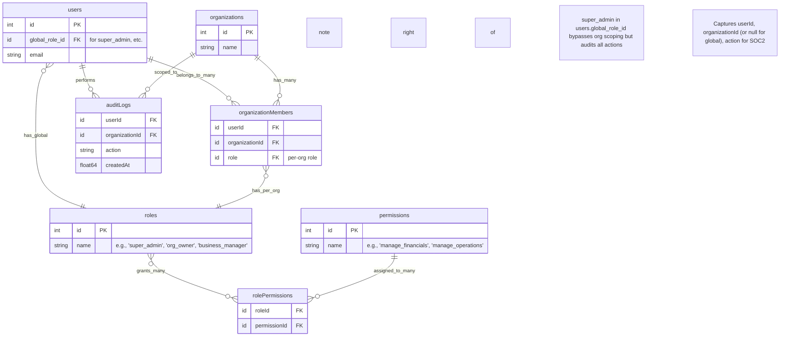

# Comprehensive RBAC Database Design for Multi-Organization System with Convex Integration

This document consolidates the role-based access control (RBAC) schema design for a multi-tenant application, tailored to your Convex backend. It incorporates multi-organization scoping, per-org role assignments, global super admin handling, and SOC2-compliant auditing. The design builds on your existing schema (`users`, `organizations`, `organizationMembers`, `roles`, `permissions`, `rolePermissions`, `auditLogs`, etc.), assuming a fresh dev DB setup with the updated fields.

To support multi-vertical reusability (e.g., invoicing, projects, events, HR), roles and permissions are generalized: Universal roles (e.g., `org_owner`, `business_manager`) grant atomic permissions across categories like financials, operations, and reporting. Vertical-specific extensions (e.g., `book_venue` for events) can be added dynamically via app installs without schema changes.

## Design Principles
- **Multi-Org Scoping:** All user activity is isolated to organizations. Users belong to many orgs via `organizationMembers` (many-to-many junction), with per-org roles for granular control (e.g., "org_owner" in Org A, "viewer" in Org B).
- **RBAC Foundation:** Roles link to permissions via `rolePermissions`. Permissions are checked at runtime for actions like read/write on resources, grouped by categories (e.g., financials, operations) for cross-vertical reuse.
- **Super Admin Handling:** Use `users.global_role_id` for global access. App logic bypasses org scoping for this role but mandates auditing in `auditLogs`. Avoid manual user-org additions to prevent maintenance issues.
- **Security & SOC2 Compliance:** Enforces least privilege per org. Audit trails in `auditLogs` capture `userId`, `organizationId` (or `null` for global), `action`, `success`, `createdAt`, etc. Flag global actions for review.
- **Convex Fit:** Leverages existing indexes (e.g., `by_user_and_org` in `organizationMembers`) for efficient queries. No new tables.
- **Scalability:** Cache contexts (e.g., Redis). Supports app installs, snapshots, purchases—all scoped via `organizationId`.
- **Vertical Reusability:** Base roles/permissions cover business primitives (e.g., `manage_financials` for invoicing/projects). Extend via resource-specific perms (e.g., `invoices` vs. `events`) seeded per vertical.

## Key Tables Overview
| Table | Key Columns | Description | Indexes (Relevant) |
|-------|-------------|-------------|--------------------|
| **users** | `id` (PK)<br>`global_role_id` (FK to roles, optional)<br>`email` (string)<br>`defaultOrgId` (FK to organizations, optional) | User accounts. `global_role_id` for super admin bypass. | `by_default_org`, `email` |
| **organizations** | `id` (PK)<br>`name` (string)<br>`slug` (string)<br>`plan` (enum) | Tenant orgs with settings (e.g., branding, features). | `by_slug`, search by `name` |
| **organizationMembers** | `userId` (FK to users)<br>`organizationId` (FK to organizations)<br>`role` (FK to roles)  | Junction: User-org memberships with per-org roles. | `by_user_and_org`, `by_org_and_role`, `by_organization`, `by_user` |
| **roles** | `id` (PK)<br>`name` (string, e.g., 'super_admin', 'org_owner', 'business_manager')<br>`isActive` (boolean) | Reusable roles (seed with universals like 'org_owner', 'business_manager'; extend for verticals like 'event_coordinator'). | `by_name` |
| **permissions** | `id` (PK)<br>`name` (string, e.g., 'manage_financials')<br>`action` (string)<br>`resource` (string) | Atomic permissions (e.g., 'write' on 'invoices'; categorized for reuse across verticals like financials/operations). | `by_name`, `by_resource_action` |
| **rolePermissions** | `roleId` (FK to roles)<br>`permissionId` (FK to permissions) | Many-to-many: Roles grant permissions. | `by_role_permission`, `by_role`, `by_permission` |
| **auditLogs** | `userId` (FK to users)<br>`organizationId` (FK to organizations)<br>`action` (string)<br>`resource` (string)<br>`success` (boolean)<br>`createdAt` (float64) | SOC2 audit trail. Use `organizationId: null` for global actions. | `by_org_and_action`, `by_timestamp`, `by_user` |

- **Other Tables (Unchanged):** `appInstallations`, `apps`, `purchases`, `snapshots`, `snapshotLoads`, etc., remain scoped via `organizationId` indexes (e.g., `by_organization`).
- **Seeding:** Insert base roles (`super_admin`, `org_owner`, etc.) and permission categories (e.g., `manage_financials` for invoicing reuse, `manage_operations` for projects/events) after setup. Vertical apps can seed extensions (e.g., `book_venue` for events).

## Updated Convex Schema Snippet
Full schema with the RBAC-aligned fields (copy-paste ready). Only `users` and `organizationMembers` are updated for FK-based roles; add `.index("by_org_and_role_fk", ["organizationId", "role"])` if needed.

```javascript
import { defineSchema, defineTable } from "convex/server";
import { v } from "convex/values";

export default defineSchema({
  // ... (unchanged tables: appInstallations, apps, auditLogs, purchases, snapshots, etc.)

  organizationMembers: defineTable({
    acceptedAt: v.optional(v.float64()),
    invitedAt: v.optional(v.float64()),
    invitedBy: v.optional(v.id("users")),
    isActive: v.boolean(),
    joinedAt: v.float64(),
    organizationId: v.id("organizations"),
    role: v.id("roles"),  // FK for dynamic per-org roles
    userId: v.id("users"),
  })
    .index("by_org_and_role", ["organizationId", "role"])
    .index("by_organization", ["organizationId"])
    .index("by_user", ["userId"])
    .index("by_user_and_org", ["userId", "organizationId"]),

  organizations: defineTable({
    bio: v.optional(v.string()),
    businessName: v.string(),
    city: v.optional(v.string()),
    contactEmail: v.optional(v.string()),
    contactPhone: v.optional(v.string()),
    country: v.optional(v.string()),
    createdAt: v.float64(),
    isActive: v.boolean(),
    isPersonalWorkspace: v.boolean(),
    name: v.string(),
    plan: v.union(
      v.literal("free"),
      v.literal("pro"),
      v.literal("personal"),
      v.literal("business"),
      v.literal("enterprise")
    ),
    postalCode: v.optional(v.string()),
    settings: v.optional(
      v.object({
        branding: v.optional(
          v.object({
            logo: v.optional(v.string()),
            primaryColor: v.optional(v.string()),
          })
        ),
        features: v.optional(
          v.object({
            apiAccess: v.optional(v.boolean()),
            customDomain: v.optional(v.boolean()),
            sso: v.optional(v.boolean()),
          })
        ),
      })
    ),
    slug: v.string(),
    street: v.optional(v.string()),
    taxId: v.optional(v.string()),
    updatedAt: v.float64(),
    website: v.optional(v.string()),
  })
    .index("by_slug", ["slug"])
    .searchIndex("search_by_name", { searchField: "name" }),

  permissions: defineTable({
    action: v.string(),
    createdAt: v.float64(),
    description: v.optional(v.string()),
    name: v.string(),
    resource: v.string(),
  })
    .index("by_name", ["name"])
    .index("by_resource", ["resource"])
    .index("by_resource_action", ["resource", "action"]),

  purchases: defineTable({
    amount: v.float64(),
    appId: v.id("apps"),
    billingPeriodEnd: v.optional(v.float64()),
    billingPeriodStart: v.optional(v.float64()),
    confirmedAt: v.optional(v.float64()),
    currency: v.string(),
    organizationId: v.id("organizations"),
    purchasedAt: v.float64(),
    refundedAt: v.optional(v.float64()),
    status: v.union(
      v.literal("pending"),
      v.literal("completed"),
      v.literal("failed"),
      v.literal("refunded")
    ),
    stripeCustomerId: v.optional(v.string()),
    stripePaymentIntentId: v.string(),
    stripeSubscriptionId: v.optional(v.string()),
    userId: v.id("users"),
  })
    .index("by_app", ["appId"])
    .index("by_organization", ["organizationId"])
    .index("by_status", ["status"])
    .index("by_stripe_payment", ["stripePaymentIntentId"])
    .index("by_stripe_subscription", ["stripeSubscriptionId"])
    .index("by_user", ["userId"]),

  rolePermissions: defineTable({
    createdAt: v.float64(),
    permissionId: v.id("permissions"),
    roleId: v.id("roles"),
  })
    .index("by_permission", ["permissionId"])
    .index("by_role", ["roleId"])
    .index("by_role_permission", ["roleId", "permissionId"]),

  roles: defineTable({
    createdAt: v.float64(),
    description: v.optional(v.string()),
    isActive: v.boolean(),
    name: v.string(),
    updatedAt: v.float64(),
  }).index("by_name", ["name"]),

  // ... (sessions, snapshotLoads, snapshots, userPasswords unchanged)

  users: defineTable({
    createdAt: v.optional(v.float64()),
    defaultOrgId: v.optional(v.id("organizations")),
    email: v.string(),
    firstName: v.optional(v.string()),
    isActive: v.optional(v.boolean()),
    lastName: v.optional(v.string()),
    preferredLanguage: v.optional(v.string()),
    global_role_id: v.optional(v.id("roles")),  // For super_admin bypass
    timezone: v.optional(v.string()),
    updatedAt: v.optional(v.float64()),
  })
    .index("by_default_org", ["defaultOrgId"])
    .index("email", ["email"])
    .searchIndex("search_by_name", {
      searchField: "firstName",
    }),

  // ... (end of schema)
});
```

## ER Diagram
Visualizes relationships, including per-org roles, global bypass, and auditing. (Paste into [Mermaid Live](https://mermaid.live) for rendering.)



## Implementation Guide
### Context Resolution (Convex Query)
Resolve user's role for a given org (or global bypass). Use in middleware for all actions.

```javascript
import { query } from "./_generated/server";
import { v } from "convex/values";

export const getUserContext = query({
  args: { userId: v.id("users"), orgId: v.optional(v.id("organizations")) },
  handler: async (ctx, { userId, orgId }) => {
    const user = await ctx.db.get(userId);
    if (user?.global_role_id) {  // Super admin bypass
      return { 
        orgId: null, 
        roleId: user.global_role_id, 
        isGlobal: true 
      };
    }
    if (!orgId) throw new Error("Org required for non-global users");
    const membership = await ctx.db
      .query("organizationMembers")
      .withIndex("by_user_and_org", (q) => 
        q.eq("userId", userId).eq("organizationId", orgId)
      )
      .filter((m) => m.isActive)  // Optional: Check active status
      .first();
    if (!membership) throw new Error("Access denied");
    return { orgId, roleId: membership.role, isGlobal: false };
  },
});
```

### Permission Check (Convex Query)
Verify if the resolved role has a specific permission, with resource filtering for verticals.

```javascript
export const hasPermission = query({
  args: { 
    roleId: v.id("roles"), 
    permName: v.string(),
    resource: v.optional(v.string())  // e.g., 'invoices' for financials vertical
  },
  handler: async (ctx, { roleId, permName, resource }) => {
    const perm = await ctx.db
      .query("permissions")
      .withIndex("by_name", (q) => q.eq("name", permName))
      .first();
    if (!perm) return false;

    const hasPerm = await ctx.db
      .query("rolePermissions")
      .withIndex("by_role_permission", (q) =>
        q.eq("roleId", roleId).eq("permissionId", perm._id)
      )
      .first();
    
    // Filter by resource for vertical isolation
    if (resource && perm.resource !== resource) return false;
    
    return !!hasPerm;
  },
});
```

### Usage Example (Action Wrapper)
Wrap app actions (e.g., querying `appInstallations` for invoicing vertical):

```javascript
export const getAppInstallations = query({
  args: { userId: v.id("users"), orgId: v.id("organizations") },
  handler: async (ctx, { userId, orgId }) => {
    const context = await getUserContext(ctx, { userId, orgId });
    if (!await hasPermission(ctx, { roleId: context.roleId, permName: "view_apps", resource: "appInstallations" })) {
      throw new Error("Insufficient permissions");
    }
    
    // For global: Query all; else scope to org
    if (context.isGlobal) {
      return await ctx.db.query("appInstallations").collect();
    }
    return await ctx.db
      .query("appInstallations")
      .withIndex("by_organization", (q) => q.eq("organizationId", orgId))
      .collect();
  },
});
```

### Audit Logging (Mutation)
Log every action (use in mutations/queries):

```javascript
export const logAudit = mutation({
  args: { 
    userId: v.id("users"), 
    orgId: v.optional(v.id("organizations")), 
    action: v.string(), 
    resource: v.string(), 
    success: v.boolean(),
    metadata: v.optional(v.any())
  },
  handler: async (ctx, args) => {
    await ctx.db.insert("auditLogs", {
      ...args,
      createdAt: Date.now(),
      organizationId: args.orgId || null  // Null for global
    });
  },
});
```

- **Call It:** After any action: `await logAudit(ctx, { userId, orgId: context.orgId, action: 'view_apps', resource: 'appInstallations', ... });`.

## Testing Tips

- **Testing:** 
  - Create test user with `global_role_id = super_admin`—verify global queries work, audits log `orgId: null`.
  - Add user to org with `role = org_owner`—confirm scoped access (e.g., `manage_financials`), permission denials for `viewer`.
  - Simulate audits: Query `auditLogs` by `by_org_and_action` for compliance reviews.
- **Edge Cases:** Inactive members (`isActive: false`), deleted orgs, concurrent joins, vertical-specific resource mismatches.

This design ensures secure, auditable multi-org RBAC without schema bloat, with reusable roles/permissions for verticals like invoicing or events. For custom queries or expansions (e.g., vertical-specific super admins), provide more details!