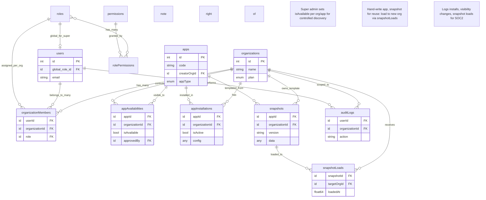

# Refined Next.js Application Architecture: Restrictive Multi-Tenant Platform with Controlled Extensibility

This refined architecture builds directly on your existing RBAC database design and App Store model, aligning them tightly to your Palantir-inspired goals: **super admin (you) holds absolute control over organizations, users, app visibility, and extensibility**, while enabling a secure, SOC2-compliant, multi-tenant SaaS platform. Key refinements include:

- **Controlled App Visibility:** App Store shows only super admin-approved apps per organization (via a new `appAvailabilities` junction table), preventing unauthorized discovery.
- **Org-Level Scoping Enforcement:** All data access, UI rendering, and actions are strictly scoped to `organizationId`, with super admin global bypass audited for compliance.
- **Extensibility & Reusability:** Common codebase via modular Convex tables/queries per app. Hand-written apps (e.g., custom verticals like invoicing for a client) can be registered, snapshotted for reuse across orgs, and installed with org-specific configs—without schema changes.
- **RBAC-App Store Integration:** Permissions like `view_apps`, `install_apps` are checked per-org, with super admin overrides. Role assignments control install eligibility.
- **No External Access:** All entry points (auth, APIs) require org context; no public routes. Users/orgs are created/invited only by super admin.
- **Monetization & Plans:** Builds on `purchases` and `organizations.plan` for tiered access (e.g., enterprise unlocks custom apps).
- **UI Sharing:** Super admin sees aggregated views (e.g., cross-org dashboards) via global queries, but org users see scoped UIs. Shared components (e.g., app windows) render dynamically based on context.
- **SOC2 Alignment:** Enhanced auditing for app installs/visibility changes; immutable snapshots for compliance proofs.

The design assumes your Next.js frontend uses Convex React hooks for queries/mutations, with middleware for context resolution. No new tools needed beyond Convex/Next.js.

## Design Principles (Refined)
- **Super Admin Control:** You (via `global_role_id = super_admin`) manage all orgs/users via dedicated admin UIs (e.g., global user/org lists). Orgs/users can't self-onboard—invites only.
- **Restrictive Scoping:** Every query/mutation resolves `getUserContext` first, enforcing `organizationId` filters unless global. App UIs (e.g., `/apps/[slug]`) load org-scoped data.
- **Extensible Common Codebase:** Apps are modular (own tables, queries, UI components). Client needs? Write a custom app module, approve for their org via `appAvailabilities`, snapshot for reuse.
- **Security:** Least privilege via RBAC; all actions audit-logged with `organizationId`. No direct DB access—Convex authz only.
- **Reusability:** Use `snapshots`/`snapshotLoads` to clone app configs/data templates across orgs (e.g., reuse a custom HR app for multiple clients).
- **Performance:** Convex indexes ensure fast scoping; cache resolved contexts client-side.

## Key Tables Overview (Updated)
Builds on your RBAC tables. **New:** `appAvailabilities` for per-org app control. All app data tables retain `creatorOrgId` for ownership.

| Table | Key Columns | Description | Indexes (Relevant) |
|-------|-------------|-------------|--------------------|
| **users** | `id` (PK)<br>`global_role_id` (FK to roles)<br>`email`<br>`defaultOrgId` (FK) | Unchanged; super admin via `global_role_id`. | Unchanged |
| **organizations** | `id` (PK)<br>`name`<br>`slug`<br>`plan` (enum) | Unchanged; plans gate app access (e.g., "enterprise" unlocks customs). | Unchanged |
| **organizationMembers** | `userId`<br>`organizationId`<br>`role` (FK to roles) | Unchanged; per-org roles control app installs. | Unchanged |
| **roles** | `id` (PK)<br>`name` (e.g., 'super_admin', 'org_owner') | Unchanged; seed with app-related roles like 'app_installer'. | Unchanged |
| **permissions** | `id` (PK)<br>`name` (e.g., 'install_apps')<br>`action`/`resource` | Add app-specific: 'view_apps' (resource: 'appStore'), 'install_apps' (resource: 'apps'). | Unchanged |
| **rolePermissions** | `roleId`<br>`permissionId` | Link 'org_owner' to 'install_apps'; super_admin gets all. | Unchanged |
| **auditLogs** | `userId`<br>`organizationId` (null for global)<br>`action` (e.g., 'app_install')<br>`resource` | Unchanged; log visibility/install changes. | Unchanged |
| **apps** | `id` (PK)<br>`code` (e.g., 'customHR')<br>`name`<br>`creatorOrgId` (your org)<br>`appType` (enum: 'shared-content'\|'private-tool'\|'interactive')<br>`price`<br>`isGlobal` (bool: visible to all unless overridden) | Unchanged; super admin only inserts/updates. | Add `by_creator` |
| **appInstallations** | `organizationId`<br>`appId`<br>`isActive`<br>`config` (org-specific) | Unchanged; scoped installs. | Unchanged |
| **appAvailabilities** *(New)* | `appId` (FK)<br>`organizationId` (FK)<br>`isAvailable` (bool)<br>`approvedBy` (FK to users)<br>`approvedAt` | Junction: Controls per-org visibility. Default: false; super admin sets true for approved orgs. | `by_org_app` (['organizationId', 'appId']), `by_app`, `by_org` |
| **purchases** | `appId`<br>`organizationId`<br>`status` | Unchanged; required for paid installs. | Unchanged |
| **snapshots** *(Enhanced)* | `appId`<br>`organizationId` (template owner)<br>`data` (JSON snapshot)<br>`version` | For reusability: Snapshot hand-written app state/config for cloning to other orgs. | `by_app_version`, `by_org` |
| **snapshotLoads** | `snapshotId`<br>`targetOrgId`<br>`loadedAt` | Load snapshot to install reusable app in new org. | `by_snapshot`, `by_target_org` |

- **App Data Tables (e.g., `customHR`):** Unchanged base fields (`creatorOrgId`, `status`, etc.); index `by_creatorOrgId` for scoping.
- **Seeding:** Super admin seeds base apps/roles. Vertical extensions (e.g., 'hr_manage_employees') added dynamically.

## Updated Convex Schema Snippet
Add `appAvailabilities` and indexes. (Copy-paste ready; assumes your full schema.)

```javascript
import { defineSchema, defineTable } from "convex/server";
import { v } from "convex/values";

export default defineSchema({
  // ... (unchanged: appInstallations, apps, auditLogs, organizationMembers, organizations, permissions, purchases, rolePermissions, roles, snapshots, users, etc.)

  appAvailabilities: defineTable({
    appId: v.id("apps"),
    approvedAt: v.float64(),
    approvedBy: v.id("users"),
    isAvailable: v.boolean(),
    organizationId: v.id("organizations"),
  })
    .index("by_org_app", ["organizationId", "appId"])
    .index("by_app", ["appId"])
    .index("by_org", ["organizationId"]),

  snapshots: defineTable({
    appId: v.id("apps"),
    data: v.any(),  // JSON of app state/config for reusability
    organizationId: v.id("organizations"),  // Template owner (your org)
    version: v.string(),
  })
    .index("by_app_version", ["appId", "version"])
    .index("by_org", ["organizationId"]),

  // ... (end of schema)
});
```

## ER Diagram (Refined)
Updated for `appAvailabilities` and snapshot reusability. (Paste into Mermaid Live.)



## Implementation Guide (Refined)
### 1. Context Resolution (Enhanced for Apps)
Unchanged from RBAC doc; call in all app-related queries.

### 2. Permission Check (App-Integrated)
Add resource filtering for 'apps' category.

```javascript
export const hasPermission = query({
  args: { roleId: v.id("roles"), permName: v.string(), resource: v.optional(v.string()) },
  handler: async (ctx, { roleId, permName, resource }) => {
    // ... (unchanged core logic)
    if (resource === 'appStore' && permName === 'install_apps') {
      // Extra check: Only if org plan allows
      const context = await getUserContext(ctx, { userId: /* from auth */, orgId: /* resolved */ });
      const org = await ctx.db.get(context.orgId);
      return !!hasPerm && org.plan !== 'free';  // e.g., gate on plan
    }
    return !!hasPerm;
  },
});
```

### 3. App Store Query (Scoped & Controlled)
Super admin sees all; org users see only available apps for their org.

```javascript
export const getAvailableApps = query({
  args: { userId: v.id("users"), orgId: v.optional(v.id("organizations")) },
  handler: async (ctx, { userId, orgId }) => {
    const context = await getUserContext(ctx, { userId, orgId });
    if (!await hasPermission(ctx, { roleId: context.roleId, permName: "view_apps", resource: "appStore" })) {
      throw new Error("Access denied");
    }

    let appsQuery = ctx.db.query("apps").filter((q) => q.eq(q.field("isActive"), true));  // Assume added isActive to apps

    if (context.isGlobal) {
      // Super admin: All apps
      return await appsQuery.collect();
    }

    // Org user: Only available for this org
    const availabilities = await ctx.db
      .query("appAvailabilities")
      .withIndex("by_org_app", (q) => q.eq("organizationId", orgId).eq("isAvailable", true))
      .collect();

    const availableAppIds = availabilities.map(a => a.appId);
    return await appsQuery.filter((q) => q.in(q.field("id"), availableAppIds)).collect();
  },
});
```

- **Audit:** `await logAudit(ctx, { userId, orgId: context.orgId, action: 'view_app_store', resource: 'apps', success: true });`

### 4. App Install Mutation (RBAC-Gated)
Checks permission, plan, availability; creates scoped installation.

```javascript
export const installApp = mutation({
  args: { userId: v.id("users"), orgId: v.id("organizations"), appId: v.id("apps"), config: v.optional(v.any()) },
  handler: async (ctx, { userId, orgId, appId, config }) => {
    const context = await getUserContext(ctx, { userId, orgId });
    if (!await hasPermission(ctx, { roleId: context.roleId, permName: "install_apps", resource: "apps" })) {
      throw new Error("Insufficient permissions");
    }

    // Check availability
    const availability = await ctx.db
      .query("appAvailabilities")
      .withIndex("by_org_app", (q) => q.eq("organizationId", orgId).eq("appId", appId).eq("isAvailable", true))
      .first();
    if (!availability && !context.isGlobal) throw new Error("App not available for your org");

    // Check purchase if paid
    const app = await ctx.db.get(appId);
    if (app.price > 0) {
      // Assume purchase flow completes first; validate status here
      const purchase = await ctx.db.query("purchases").withIndex("by_app_organization", (q) => q.eq("appId", appId).eq("organizationId", orgId).eq("status", "completed")).first();
      if (!purchase) throw new Error("Purchase required");
    }

    const installation = await ctx.db.insert("appInstallations", {
      organizationId: orgId,
      appId,
      isActive: true,
      config: config || {},
      installedAt: Date.now(),
    });

    await logAudit(ctx, { userId, orgId, action: 'install_app', resource: `apps/${app.code}`, success: true, metadata: { installationId: installation } });
    return installation;
  },
});
```

### 5. Reusability Workflow: Hand-Write & Reuse App
1. **Write Custom App:** For client X (e.g., custom invoicing vertical), create `convex/customInvoice.ts` with queries/mutations scoped to `creatorOrgId = orgId`. Add to schema/apps registry with `creatorOrgId = your_org`.
2. **Approve Visibility:** As super admin, insert `appAvailabilities` for client X's org: `{appId, organizationId: clientX, isAvailable: true}`.
3. **Snapshot for Reuse:** `await ctx.db.insert("snapshots", {appId, organizationId: your_org, data: {config, seedData}, version: 'v1'})`.
4. **Reuse for Client Y:** Install base app, then `mutation` to load snapshot: Insert `snapshotLoads`, merge `data` into new rows with `creatorOrgId = clientY`.
5. **UI:** Dynamic route `/apps/[code]` loads `<AppWindow code={code} />`—renders shared UI, but queries scoped via context.

### 6. Super Admin UIs (Next.js Example)
- **Global Orgs/Users:** `/admin/orgs`—query all `organizations`, invite users via mutation (sets `defaultOrgId`, inserts `organizationMembers` with role).
- **App Management:** `/admin/apps`—CRUD `apps`, bulk-set `appAvailabilities` (e.g., approve custom for specific orgs).
- **Cross-Org Dashboards:** Use global context to aggregate (e.g., view all `customInvoice` where `status='published'`).

```tsx
// src/pages/admin/apps.tsx (Next.js)
import { useQuery } from 'convex/react';
import { api } from '../../convex/_generated/api';

export default function AdminApps() {
  const apps = useQuery(api.apps.listAll);  // Global query, assumes super admin auth
  // Render table with approve buttons: onClick -> mutation to insert appAvailabilities
}
```

### 7. Frontend Scoping (Next.js Middleware)
Use Next.js middleware to inject org context from auth/cookies.

```ts
// middleware.ts
import { NextResponse } from 'next/server';

export function middleware(req) {
  const orgId = req.cookies.get('orgId')?.value;  // From login
  if (!orgId && !req.url.includes('/admin')) return NextResponse.redirect('/login');
  // Pass to headers for Convex auth
  const res = NextResponse.next();
  res.headers.set('x-org-id', orgId);
  return res;
}
```

- In components: `useQuery(api.apps.getAvailableApps, { orgId: useOrgId() })`—renders scoped app store.

## Testing & Rollout Tips
- **Super Admin Flow:** Create test org/user via global mutation; approve/install app; verify scoping (e.g., viewer role can't install).
- **Reusability Test:** Hand-write mini-app, snapshot, load to new org—check data isolation via `creatorOrgId`.
- **Security Audit:** Simulate unauthorized access; confirm denials + logs. Review `auditLogs` for `action: 'install_app'`.
- **Edge Cases:** Paid app without purchase; revoked availability mid-session; snapshot conflicts.
- **Next Steps:** 
  1. Add `appAvailabilities` to schema, seed base approvals.
  2. Implement admin UIs for approvals/snapshots.
  3. Migrate existing apps to include `creatorOrgId`.
  4. Add plan-gating to permissions.

This refinement locks down control while enabling seamless extensibility—your common codebase stays lean, clients get tailored value, and security holds firm. For specific code snippets (e.g., a custom app module), share details!