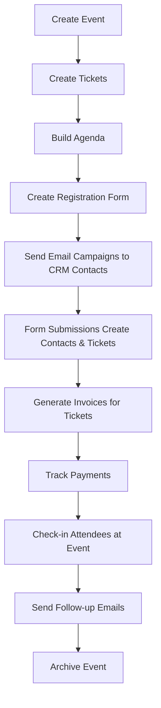

# Event Management & CRM Application Architecture

**Last Updated:** 2025-10-10
**Status:** 🎯 **DESIGN DOCUMENT**
**Version:** 1.0.0

---

## 📋 Table of Contents

1. [Overview](#overview)
2. [Core Applications](#core-applications)
3. [Ontology Object Models](#ontology-object-models)
4. [App Architecture](#app-architecture)
5. [Data Flow & Relationships](#data-flow--relationships)
6. [Snapshot Templates](#snapshot-templates)
7. [Permission Model](#permission-model)
8. [Implementation Roadmap](#implementation-roadmap)

---

## Overview

### 🎯 Vision

Build a comprehensive event management and project management suite within L4YERCAK3 that provides:

- **Event Management**: Complete event lifecycle management with tickets, attendees, and agendas
- **CRM Integration**: Customer/contact management that powers event invitations
- **Invoicing**: B2B and B2C invoicing connected to events and tickets
- **Email Workflows**: Template-based email campaigns for event marketing
- **Form Builder**: Online forms for ticket registration and data collection
- **Project Management**: Task tracking and collaboration tools

### 🏗️ Architecture Principles

1. **Ontology-First**: All data stored as `objects` in the universal ontology system
2. **Organization-Scoped**: Every object belongs to an organization via `organizationId`
3. **Snapshot-Based Apps**: Apps use snapshots for configuration and templates
4. **Graph Relationships**: Links connect objects (events → tickets → attendees)
5. **Reusable Components**: Apps can be extracted for general project management use

---

## Core Applications

### App 1: Event Manager (`app_event_manager`)

**Purpose**: Complete event lifecycle management

**Key Features:**
- Event creation and management
- Agenda/schedule builder
- Sponsor management
- Event settings and customization
- Multi-event support

**Data Scope**: `installer-owned` (each org manages their own events)

---

### App 2: Ticket System (`app_tickets`)

**Purpose**: Ticketing and attendee registration

**Key Features:**
- Multiple ticket types (VIP, General, Early Bird)
- Pricing tiers and discount codes
- Capacity management
- Ticket status tracking (pending, confirmed, checked-in, cancelled)
- QR code generation for check-in

**Data Scope**: `installer-owned` (org-specific tickets)

---

### App 3: CRM - Contacts & Organizations (`app_crm`)

**Purpose**: Customer relationship management

**Key Features:**
- Contact management (individuals)
- Organization management (companies)
- Contact groups/segments
- Tag-based organization
- Activity history
- Custom fields (via ontology customProperties)

**Data Scope**: `installer-owned` (each org owns their contacts)

---

### App 4: Email Marketing (`app_email_marketing`)

**Purpose**: Email campaigns and automation

**Key Features:**
- Template builder with merge fields
- Contact group targeting
- Email scheduling
- Delivery tracking
- Template library (event invites, follow-ups, newsletters)

**Data Scope**: `installer-owned` (org-specific campaigns)

---

### App 5: Form Builder (`app_forms`)

**Purpose**: Online forms for data collection

**Key Features:**
- Drag-and-drop form builder
- Multiple field types (text, email, dropdown, file upload)
- Form submissions storage
- Integration with tickets and CRM
- Public form URLs with org branding

**Data Scope**: `installer-owned` (org-specific forms)

---

### App 6: Invoicing (`app_invoicing`)

**Purpose**: B2B and B2C invoicing

**Key Features:**
- Invoice creation and management
- Line items with pricing
- Payment tracking (unpaid, partial, paid)
- Invoice templates
- PDF generation
- Integration with events and tickets
- Standalone invoicing (no event required)

**Data Scope**: `installer-owned` (org-specific invoices)

---

### App 7: Project Management (`app_projects`)

**Purpose**: Task and project tracking (extracted from event management)

**Key Features:**
- Project creation
- Task management
- Task assignment
- Deadlines and milestones
- Status tracking
- Team collaboration

**Data Scope**: `installer-owned` (org-specific projects)

---

## Ontology Object Models

All data is stored in the `objects` table with different `type` and `subtype` values.

### Event Objects

```typescript
{
  type: "event",
  subtype: "conference" | "webinar" | "workshop" | "meetup" | "podcast_live",
  name: "Annual Conference 2024",
  description: "Three-day tech conference",
  status: "draft" | "published" | "in_progress" | "completed" | "cancelled",
  organizationId: v.id("organizations"),
  customProperties: {
    startDate: 1234567890,
    endDate: 1234567890,
    location: "San Francisco Convention Center",
    maxCapacity: 500,
    registrationDeadline: 1234567890,
    eventUrl: "https://example.com/events/conf2024",
    timezone: "America/Los_Angeles",
    isVirtual: false,
    virtualPlatform: null, // "Zoom", "Teams", etc.
  }
}
```

### Ticket Objects

```typescript
{
  type: "ticket",
  subtype: "vip" | "general" | "early_bird" | "group" | "free",
  name: "VIP Access - Conference 2024",
  description: "Full access with exclusive perks",
  status: "available" | "sold_out" | "pending" | "confirmed" | "checked_in" | "cancelled",
  organizationId: v.id("organizations"),
  customProperties: {
    eventId: v.id("objects"), // Link to event object
    price: 499.00,
    currency: "USD",
    quantity: 1,
    ticketNumber: "CONF2024-VIP-001",
    purchaseDate: 1234567890,
    checkInDate: null,
    qrCode: "base64_encoded_qr",
    discountCode: "EARLY2024",
    discountAmount: 100.00,

    // Attendee info (or link to contact object)
    attendeeFirstName: "John",
    attendeeLastName: "Doe",
    attendeeEmail: "john@example.com",
    attendeePhone: "+1234567890",

    // Access control
    accessLevel: "full", // "full", "limited", "speaker"
    sessionAccess: ["keynote", "workshop_a", "networking"],

    // Dietary/Special requirements
    dietaryRestrictions: "vegetarian",
    specialRequirements: "wheelchair access",
  }
}

// Links:
// ticket --[registers_for]--> event
// ticket --[issued_to]--> contact (CRM)
// ticket --[paid_by]--> invoice
```

### Attendee (Contact) Objects

```typescript
{
  type: "contact",
  subtype: "customer" | "lead" | "partner" | "vendor" | "attendee",
  name: "John Doe",
  description: "Tech entrepreneur, frequent event attendee",
  status: "active" | "inactive" | "archived",
  organizationId: v.id("organizations"),
  customProperties: {
    firstName: "John",
    lastName: "Doe",
    email: "john@example.com",
    phone: "+1234567890",
    company: "Acme Corp",
    jobTitle: "CTO",

    // Social
    linkedin: "https://linkedin.com/in/johndoe",
    twitter: "@johndoe",

    // CRM
    source: "website_form", // "referral", "event", "manual"
    tags: ["vip", "speaker", "sponsor"],
    notes: "Interested in sponsorship opportunities",

    // Segmentation
    industry: "technology",
    companySize: "50-200",
    region: "North America",

    // Communication preferences
    emailOptIn: true,
    smsOptIn: false,
    preferredLanguage: "en",
  }
}

// Links:
// contact --[member_of]--> organization (CRM org)
// contact --[registers_for]--> event
// contact --[owns]--> ticket
// contact --[receives]--> email_campaign
```

### CRM Organization Objects

```typescript
{
  type: "crm_organization",
  subtype: "sponsor" | "partner" | "vendor" | "customer" | "prospect",
  name: "Acme Corp",
  description: "Global technology solutions provider",
  status: "active" | "inactive" | "archived",
  organizationId: v.id("organizations"), // The L4YERCAK3 org that owns this CRM record
  customProperties: {
    industry: "Technology",
    companySize: "500-1000",
    website: "https://acmecorp.com",
    headquarters: "San Francisco, CA",
    founded: 2010,

    // Contact info
    primaryEmail: "contact@acmecorp.com",
    primaryPhone: "+14155551234",

    // Business details
    taxId: "12-3456789",
    accountManager: v.id("users"),

    // Relationship
    customerSince: 1234567890,
    lifetimeValue: 50000,
    lastContactDate: 1234567890,

    // Tags and segments
    tags: ["enterprise", "recurring", "sponsor"],
    tier: "gold", // "bronze", "silver", "gold", "platinum"
  }
}

// Links:
// crm_organization --[sponsors]--> event
// crm_organization --[employs]--> contact
// crm_organization --[has_address]--> address (via objectLinks)
```

### Agenda/Session Objects

```typescript
{
  type: "agenda_item",
  subtype: "keynote" | "workshop" | "breakout" | "networking" | "break",
  name: "Opening Keynote: Future of AI",
  description: "Exploring the next decade of artificial intelligence",
  status: "scheduled" | "in_progress" | "completed" | "cancelled",
  organizationId: v.id("organizations"),
  customProperties: {
    eventId: v.id("objects"), // Link to event
    startTime: 1234567890,
    endTime: 1234567890,
    duration: 90, // minutes
    location: "Main Hall",
    virtualRoom: "https://zoom.us/j/123456789",

    // Speakers/Presenters
    speakers: [
      { contactId: v.id("objects"), name: "Dr. Jane Smith", role: "Presenter" }
    ],

    // Capacity
    maxAttendees: 500,
    requiresTicket: true,
    allowedTicketTypes: ["vip", "general"],

    // Content
    agenda: "1. Introduction\n2. Main Topics\n3. Q&A",
    materials: ["https://slides.com/presentation-01"],
    recordingUrl: null, // Added after event
  }
}

// Links:
// agenda_item --[part_of]--> event
// agenda_item --[presented_by]--> contact
// ticket --[grants_access_to]--> agenda_item
```

### Email Campaign Objects

```typescript
{
  type: "email_campaign",
  subtype: "invitation" | "reminder" | "follow_up" | "newsletter" | "announcement",
  name: "Conference 2024 Invitation",
  description: "Initial invitation email for annual conference",
  status: "draft" | "scheduled" | "sending" | "sent" | "failed",
  organizationId: v.id("organizations"),
  customProperties: {
    templateId: v.id("objects"), // Link to email template

    // Targeting
    targetSegments: ["vip", "past_attendees"],
    recipientCount: 1500,

    // Scheduling
    scheduledFor: 1234567890,
    sentAt: null,

    // Content (with merge fields)
    subject: "You're Invited: {{event.name}}",
    bodyHtml: "<html>...</html>",
    bodyText: "Plain text version...",

    // Tracking
    openRate: 0.45,
    clickRate: 0.12,
    bounceRate: 0.02,
    unsubscribeRate: 0.005,

    // Links to track
    trackedLinks: [
      { url: "https://example.com/register", clicks: 180 }
    ],
  }
}

// Links:
// email_campaign --[targets]--> contact (many)
// email_campaign --[promotes]--> event
// email_campaign --[uses_template]--> email_template
```

### Email Template Objects

```typescript
{
  type: "email_template",
  subtype: "invitation" | "reminder" | "follow_up" | "thank_you" | "confirmation",
  name: "Event Invitation - Modern Design",
  description: "Professional invitation template with hero image",
  status: "active" | "archived",
  organizationId: v.id("organizations"),
  customProperties: {
    // Template content with merge fields
    subject: "You're Invited: {{event.name}}",
    bodyHtml: `
      <html>
        <body>
          <h1>{{event.name}}</h1>
          <p>Dear {{contact.firstName}},</p>
          <p>We're excited to invite you to {{event.name}} on {{event.startDate}}.</p>
          <a href="{{event.registrationUrl}}">Register Now</a>
        </body>
      </html>
    `,
    bodyText: "Plain text version...",

    // Available merge fields
    mergeFields: [
      "contact.firstName",
      "contact.lastName",
      "event.name",
      "event.startDate",
      "event.location",
      "ticket.price",
      "organization.name"
    ],

    // Design
    theme: "modern",
    primaryColor: "#6B46C1",
    logoUrl: "https://cdn.example.com/logo.png",

    // Usage stats
    timesUsed: 45,
    lastUsedAt: 1234567890,
  }
}
```

### Form Objects

```typescript
{
  type: "form",
  subtype: "registration" | "survey" | "feedback" | "contact" | "application",
  name: "Conference Registration Form",
  description: "Collect attendee information and preferences",
  status: "active" | "inactive" | "archived",
  organizationId: v.id("organizations"),
  customProperties: {
    // Form configuration
    fields: [
      {
        id: "field_001",
        type: "text",
        label: "First Name",
        required: true,
        placeholder: "Enter your first name",
      },
      {
        id: "field_002",
        type: "email",
        label: "Email Address",
        required: true,
      },
      {
        id: "field_003",
        type: "dropdown",
        label: "Session Interest",
        options: ["AI Track", "Web3 Track", "Cloud Track"],
        required: false,
      },
      {
        id: "field_004",
        type: "file",
        label: "Resume/CV",
        maxSize: 5242880, // 5MB
        acceptedTypes: [".pdf", ".docx"],
      }
    ],

    // Submission settings
    submissionLimit: null, // or number for max submissions
    allowMultipleSubmissions: false,
    requireAuth: false,
    captchaEnabled: true,

    // Post-submission
    successMessage: "Thank you for registering!",
    redirectUrl: "https://example.com/confirmation",
    sendConfirmationEmail: true,

    // Integration
    linkedEventId: v.id("objects"), // Link to event
    createContact: true, // Auto-create contact from submission
    createTicket: true, // Auto-create ticket from submission

    // Public access
    publicUrl: "https://l4yercak3.com/forms/conf2024-reg",
    isPublic: true,

    // Stats
    totalSubmissions: 1247,
    lastSubmissionAt: 1234567890,
  }
}

// Links:
// form --[collects_for]--> event
// form_submission --[submitted_to]--> form
// form_submission --[creates]--> contact
// form_submission --[creates]--> ticket
```

### Form Submission Objects

```typescript
{
  type: "form_submission",
  subtype: "pending" | "processed" | "archived",
  name: "Registration Submission - John Doe",
  description: "Form submission from john@example.com",
  status: "pending" | "processed" | "archived",
  organizationId: v.id("organizations"),
  customProperties: {
    formId: v.id("objects"),

    // Submission data (matches form fields)
    data: {
      field_001: "John",
      field_002: "john@example.com",
      field_003: "AI Track",
      field_004: "https://storage.com/resume.pdf",
    },

    // Metadata
    submittedAt: 1234567890,
    submittedFrom: {
      ip: "192.168.1.1",
      userAgent: "Mozilla/5.0...",
      referer: "https://example.com/event",
    },

    // Processing
    processedAt: null,
    createdContactId: null, // Link to created contact
    createdTicketId: null, // Link to created ticket
  }
}

// Links:
// form_submission --[submitted_to]--> form
// form_submission --[created]--> contact
// form_submission --[created]--> ticket
```

### Invoice Objects

```typescript
{
  type: "invoice",
  subtype: "b2b" | "b2c" | "event_related" | "standalone",
  name: "INV-2024-001",
  description: "Conference ticket purchase - 3x VIP passes",
  status: "draft" | "sent" | "viewed" | "partial" | "paid" | "overdue" | "cancelled",
  organizationId: v.id("organizations"),
  customProperties: {
    // Invoice details
    invoiceNumber: "INV-2024-001",
    issueDate: 1234567890,
    dueDate: 1234567890,
    paidDate: null,

    // Parties
    billedToContactId: v.id("objects"), // Contact or CRM org
    billedToName: "Acme Corp",
    billedToEmail: "billing@acmecorp.com",
    billedToAddress: "123 Main St, San Francisco, CA 94105",

    // Line items
    items: [
      {
        id: "item_001",
        description: "VIP Conference Pass",
        quantity: 3,
        unitPrice: 499.00,
        amount: 1497.00,
        linkedTicketIds: [v.id("objects"), v.id("objects"), v.id("objects")],
      },
      {
        id: "item_002",
        description: "Workshop Add-on",
        quantity: 2,
        unitPrice: 149.00,
        amount: 298.00,
      }
    ],

    // Financials
    subtotal: 1795.00,
    tax: 179.50,
    discount: 0,
    total: 1974.50,
    amountPaid: 0,
    amountDue: 1974.50,
    currency: "USD",

    // Payment
    paymentMethod: null, // "credit_card", "bank_transfer", "check"
    paymentNotes: null,
    stripeInvoiceId: null,

    // PDF
    pdfUrl: "https://storage.com/invoices/INV-2024-001.pdf",

    // Notes
    notes: "Payment due within 30 days",
    internalNotes: "Corporate customer, net-30 terms",
  }
}

// Links:
// invoice --[billed_to]--> contact or crm_organization
// invoice --[includes]--> ticket (via line items)
// invoice --[related_to]--> event
```

### Project Objects

```typescript
{
  type: "project",
  subtype: "event_planning" | "campaign" | "development" | "general",
  name: "Conference 2024 Planning",
  description: "Master project for annual conference",
  status: "planning" | "in_progress" | "on_hold" | "completed" | "cancelled",
  organizationId: v.id("organizations"),
  customProperties: {
    startDate: 1234567890,
    endDate: 1234567890,
    deadline: 1234567890,

    // Team
    projectManager: v.id("users"),
    teamMembers: [v.id("users"), v.id("users")],

    // Progress
    completionPercentage: 65,
    milestones: [
      { name: "Venue Secured", date: 1234567890, completed: true },
      { name: "Speakers Confirmed", date: 1234567890, completed: true },
      { name: "Registration Open", date: 1234567890, completed: false },
    ],

    // Budget
    budgetTotal: 100000,
    budgetSpent: 45000,

    // Links
    relatedEventId: v.id("objects"), // If project is for an event
  }
}

// Links:
// project --[manages]--> event
// project --[includes]--> task (many)
// project --[assigned_to]--> user (team members)
```

### Task Objects

```typescript
{
  type: "task",
  subtype: "planning" | "marketing" | "logistics" | "follow_up" | "general",
  name: "Book keynote speaker",
  description: "Reach out to Dr. Jane Smith for keynote",
  status: "todo" | "in_progress" | "blocked" | "completed" | "cancelled",
  organizationId: v.id("organizations"),
  customProperties: {
    projectId: v.id("objects"),

    // Assignment
    assignedTo: v.id("users"),
    assignedBy: v.id("users"),
    assignedAt: 1234567890,

    // Timing
    dueDate: 1234567890,
    startDate: 1234567890,
    completedAt: null,

    // Priority
    priority: "low" | "medium" | "high" | "urgent",

    // Effort
    estimatedHours: 4,
    actualHours: null,

    // Dependencies
    blockedBy: [v.id("objects")], // Other task IDs
    blocks: [], // Tasks that depend on this

    // Checklist
    checklist: [
      { id: "check_001", text: "Research speaker", completed: true },
      { id: "check_002", text: "Send invitation", completed: false },
      { id: "check_003", text: "Negotiate fee", completed: false },
    ],

    // Comments/Notes
    comments: [
      { userId: v.id("users"), text: "Sent initial email", timestamp: 1234567890 }
    ],
  }
}

// Links:
// task --[part_of]--> project
// task --[assigned_to]--> user
// task --[blocks]--> task (dependencies)
// task --[related_to]--> event
```

---

## App Architecture

### App Registration in `apps` Table

Each app is registered with:

```typescript
{
  code: "app_event_manager",
  name: "Event Manager",
  description: "Complete event lifecycle management",
  category: "administration",
  plans: ["pro", "business", "enterprise"],
  creatorOrgId: "org_system", // System app
  dataScope: "installer-owned", // Each org owns their data
  status: "active",
  price: 0, // Free with subscription
  version: "1.0.0",
}
```

### App Installation Flow

1. **Organization installs app** → Creates entry in `appInstallations`
2. **Snapshot template loaded** → Creates entry in `snapshotLoads`
3. **Initial config applied** → Org can customize settings
4. **Data isolation enforced** → All queries filter by `organizationId`

### Multi-App Integration

Apps are designed to work independently BUT integrate seamlessly:

- **Event Manager** can work alone
- **+ Ticket System** = Ticketed events
- **+ CRM** = Invite existing contacts
- **+ Email Marketing** = Send invitations to contact groups
- **+ Forms** = Online registration forms
- **+ Invoicing** = Billing for tickets
- **+ Project Management** = Plan the event execution

---

## Data Flow & Relationships

### Complete Event Lifecycle



### Object Relationships via `objectLinks`

```typescript
// Event → Tickets
{
  fromObjectId: eventId,
  toObjectId: ticketId,
  linkType: "has_ticket",
}

// Ticket → Contact (Attendee)
{
  fromObjectId: ticketId,
  toObjectId: contactId,
  linkType: "issued_to",
}

// Contact → CRM Organization
{
  fromObjectId: contactId,
  toObjectId: crmOrgId,
  linkType: "works_for",
}

// CRM Organization → Event (Sponsor)
{
  fromObjectId: crmOrgId,
  toObjectId: eventId,
  linkType: "sponsors",
  properties: {
    sponsorshipLevel: "gold",
    amount: 50000,
  }
}

// Email Campaign → Event
{
  fromObjectId: emailCampaignId,
  toObjectId: eventId,
  linkType: "promotes",
}

// Form → Event
{
  fromObjectId: formId,
  toObjectId: eventId,
  linkType: "registers_for",
}

// Invoice → Tickets (many)
{
  fromObjectId: invoiceId,
  toObjectId: ticketId,
  linkType: "includes_line_item",
}

// Agenda Item → Event
{
  fromObjectId: agendaItemId,
  toObjectId: eventId,
  linkType: "part_of",
}

// Task → Project
{
  fromObjectId: taskId,
  toObjectId: projectId,
  linkType: "belongs_to",
}

// Project → Event
{
  fromObjectId: projectId,
  toObjectId: eventId,
  linkType: "manages",
}
```

---

## Snapshot Templates

### Event Manager Snapshot

```typescript
{
  appId: "app_event_manager",
  name: "Conference Template",
  description: "Full-featured conference event template",
  config: {
    defaultEventType: "conference",
    enableSponsors: true,
    enableAgenda: true,
    requireApproval: false,
    branding: {
      primaryColor: "#6B46C1",
      logoUrl: null,
    }
  },
  seedData: [
    {
      table: "objects",
      data: [
        {
          type: "event",
          subtype: "conference",
          name: "Sample Conference",
          status: "draft",
          customProperties: {
            startDate: Date.now() + 90 * 24 * 60 * 60 * 1000, // 90 days from now
            endDate: Date.now() + 92 * 24 * 60 * 60 * 1000,
            maxCapacity: 500,
          }
        }
      ]
    }
  ],
  version: "1.0.0",
}
```

### CRM Snapshot

```typescript
{
  appId: "app_crm",
  name: "Basic CRM Setup",
  description: "Contact and organization management starter",
  config: {
    enableCustomFields: true,
    defaultContactTags: ["lead", "customer", "partner"],
    enableActivityTracking: true,
  },
  seedData: [
    {
      table: "objects",
      data: [
        // Sample contact groups, tags, etc.
      ]
    }
  ],
  version: "1.0.0",
}
```

---

## Permission Model

### Event Manager Permissions

```typescript
// New permissions to add to the permissions table:
[
  { name: "create_event", resource: "events", action: "create" },
  { name: "manage_events", resource: "events", action: "manage" },
  { name: "view_events", resource: "events", action: "read" },
  { name: "delete_event", resource: "events", action: "delete" },

  { name: "manage_tickets", resource: "tickets", action: "manage" },
  { name: "view_tickets", resource: "tickets", action: "read" },
  { name: "check_in_attendees", resource: "tickets", action: "check_in" },

  { name: "manage_contacts", resource: "crm", action: "manage" },
  { name: "view_contacts", resource: "crm", action: "read" },
  { name: "export_contacts", resource: "crm", action: "export" },

  { name: "send_email_campaigns", resource: "email", action: "send" },
  { name: "manage_email_templates", resource: "email", action: "manage" },

  { name: "create_forms", resource: "forms", action: "create" },
  { name: "view_form_submissions", resource: "forms", action: "read" },

  { name: "create_invoice", resource: "invoices", action: "create" },
  { name: "approve_invoice", resource: "invoices", action: "approve" },
  { name: "view_invoices", resource: "invoices", action: "read" },

  { name: "manage_projects", resource: "projects", action: "manage" },
  { name: "assign_tasks", resource: "tasks", action: "assign" },
  { name: "complete_tasks", resource: "tasks", action: "complete" },
]
```

### Role Assignments

| Role | Event Permissions | CRM | Email | Invoicing |
|------|-------------------|-----|-------|-----------|
| **Super Admin** | All | All | All | All |
| **Org Owner** | All | All | All | All |
| **Business Manager** | Manage events, tickets | Manage | Send | Create, Approve |
| **Event Coordinator** | Manage events, check-in | View | Send | View |
| **Employee** | View events | View | - | View |
| **Viewer** | View events | - | - | - |

---

## Implementation Roadmap

### Phase 1: Core Event Management (Weeks 1-2)

**Goal**: MVP event creation and ticket management

**Tasks**:
1. ✅ Create `app_event_manager` registration
2. ✅ Define event object model in ontology
3. ✅ Define ticket object model in ontology
4. ✅ Create `convex/eventManagement.ts` with queries/mutations:
   - `createEvent()`
   - `updateEvent()`
   - `deleteEvent()`
   - `listEvents()` (org-scoped)
   - `getEventById()`
5. ✅ Create `convex/ticketManagement.ts`:
   - `createTicket()`
   - `updateTicketStatus()`
   - `checkInAttendee()`
   - `listTicketsForEvent()`
6. ✅ Add RBAC permissions for events and tickets
7. ✅ Create snapshot template for Event Manager
8. ✅ Build UI: Event creation window
9. ✅ Build UI: Ticket list and management
10. ✅ Test: Create event, add tickets, check-in flow

**Deliverable**: Working event manager with basic ticketing

---

### Phase 2: CRM Integration (Weeks 3-4)

**Goal**: Contact management and event invitations

**Tasks**:
1. ✅ Create `app_crm` registration
2. ✅ Define contact and crm_organization models
3. ✅ Create `convex/crmManagement.ts`:
   - `createContact()`
   - `updateContact()`
   - `listContacts()` (with search/filter)
   - `createCrmOrganization()`
   - `linkContactToOrganization()`
4. ✅ Create contact groups/tags system
5. ✅ Build UI: Contact list with search
6. ✅ Build UI: Contact detail view
7. ✅ Build UI: Organization management
8. ✅ Integration: Link tickets to contacts
9. ✅ Test: Import contacts, link to events

**Deliverable**: Working CRM with event integration

---

### Phase 3: Email Marketing (Weeks 5-6)

**Goal**: Email campaigns and templates

**Tasks**:
1. ✅ Create `app_email_marketing` registration
2. ✅ Define email_campaign and email_template models
3. ✅ Create `convex/emailMarketing.ts`:
   - `createTemplate()`
   - `createCampaign()`
   - `sendCampaign()`
   - `trackEmailOpen()`
   - `trackEmailClick()`
4. ✅ Implement merge field system
5. ✅ Build UI: Template editor
6. ✅ Build UI: Campaign builder with contact group targeting
7. ✅ Integration: Send to CRM contact groups
8. ✅ Test: Create campaign, send to contacts

**Deliverable**: Email marketing system with templates

---

### Phase 4: Forms & Registration (Week 7)

**Goal**: Public forms for event registration

**Tasks**:
1. ✅ Create `app_forms` registration
2. ✅ Define form and form_submission models
3. ✅ Create `convex/formManagement.ts`:
   - `createForm()`
   - `submitForm()` (public action)
   - `listSubmissions()`
   - `processSubmission()` (auto-create contact/ticket)
4. ✅ Build UI: Form builder
5. ✅ Build UI: Public form renderer
6. ✅ Build UI: Submission viewer
7. ✅ Integration: Link forms to events
8. ✅ Test: Create form, submit, auto-create contact

**Deliverable**: Form builder with auto-registration

---

### Phase 5: Invoicing (Week 8)

**Goal**: B2B/B2C invoicing for tickets

**Tasks**:
1. ✅ Create `app_invoicing` registration
2. ✅ Define invoice model
3. ✅ Create `convex/invoicing.ts`:
   - `createInvoice()`
   - `addLineItem()`
   - `markAsPaid()`
   - `generatePDF()` (action)
4. ✅ Build UI: Invoice creator
5. ✅ Build UI: Invoice list
6. ✅ Integration: Link invoices to tickets
7. ✅ Integration: Stripe payment gateway (optional)
8. ✅ Test: Create invoice, link to event, mark paid

**Deliverable**: Full invoicing system

---

### Phase 6: Agenda & Project Management (Weeks 9-10)

**Goal**: Event agendas and project/task tracking

**Tasks**:
1. ✅ Define agenda_item, project, and task models
2. ✅ Create `convex/agendaManagement.ts`:
   - `createAgendaItem()`
   - `updateAgendaItem()`
   - `listAgendaForEvent()`
3. ✅ Create `convex/projectManagement.ts`:
   - `createProject()`
   - `createTask()`
   - `assignTask()`
   - `updateTaskStatus()`
4. ✅ Build UI: Agenda builder for events
5. ✅ Build UI: Project list and task board
6. ✅ Test: Create project, add tasks, link to event

**Deliverable**: Project management + event agendas

---

### Phase 7: Polish & Testing (Week 11)

**Goal**: Production-ready apps with full integration

**Tasks**:
1. ✅ Full integration testing (all apps together)
2. ✅ Performance optimization (query indexes)
3. ✅ UI polish and responsive design
4. ✅ Documentation for end users
5. ✅ Permission testing (all roles)
6. ✅ Snapshot template refinement
7. ✅ Demo data generation
8. ✅ Deploy to production

**Deliverable**: Complete event management suite

---

## Success Metrics

### Technical Success

- ✅ All apps use ontology system (no separate tables)
- ✅ All queries properly scoped to `organizationId`
- ✅ All apps installable via snapshots
- ✅ Zero hard-coded organization data
- ✅ Full RBAC integration
- ✅ All object relationships via `objectLinks`

### User Success

- ✅ Create a full event from scratch in < 15 minutes
- ✅ Send targeted email campaigns to CRM groups
- ✅ Generate and send invoices for ticket sales
- ✅ Online registration form with auto-ticket creation
- ✅ Check-in attendees on event day
- ✅ Project planning for event execution

### Business Success

- ✅ Apps work independently AND together
- ✅ Reusable for non-event project management
- ✅ Extensible via ontology `customProperties`
- ✅ Multi-org data isolation enforced
- ✅ Snapshot templates for quick setup

---

## Next Steps

1. **Review this architecture** - Confirm object models and relationships
2. **Prioritize apps** - Which app to build first? (Recommend: Event Manager)
3. **Create implementation issues** - Break down Phase 1 into tasks
4. **Begin coding** - Start with core event management mutations/queries

---

**Last Updated:** 2025-10-10
**Status:** 🎯 Design Complete - Ready for Implementation
**Questions?** Review with the team before starting Phase 1
