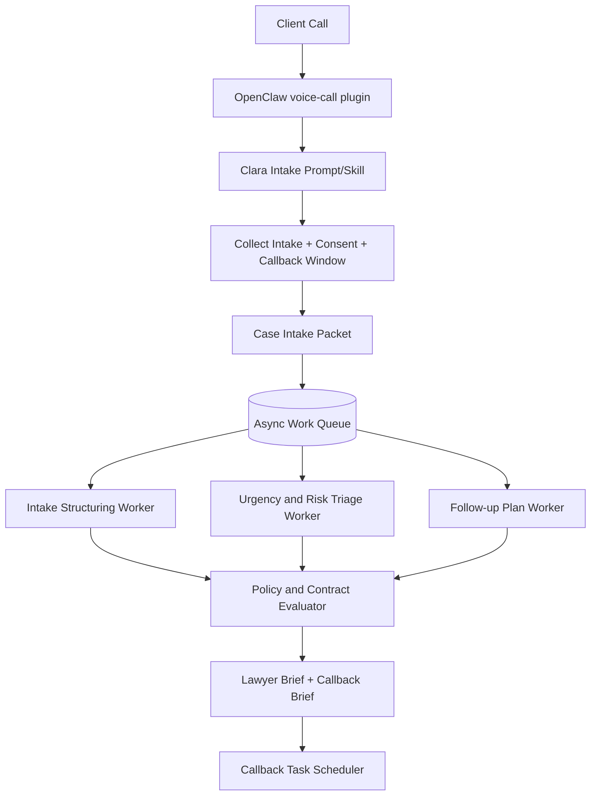

# Kanzlei Assistant MVP Topology

This document defines the topology for the current MVP only.

## Architecture decision (upstream-first, no parallel systems)

For MVP, keep one upstream-aligned runtime path:

1. Live intake call path reuses OpenClaw `voice-call` + `elevenlabs` + provider plugin surfaces.
2. Post-call processing runs as async worker flow on top of existing OpenClaw/NemoClaw seams.
3. No second telephony orchestrator, no specialist telephony transfer tree, no parallel model-router sidecar.

## MVP topology diagram

## Runtime seams (must remain upstream)

1. Telephony channel: `voice-call` extension/skill surfaces.
2. Speech: bundled `elevenlabs` plugin path.
3. Model routing: upstream provider plugin path (`openrouter` or approved equivalent).
4. Runtime safety: NemoClaw/OpenShell policy model with Germany-specific overlays only.
5. Local customization: prompts, packet schemas, worker contracts, and compliance/runbook artifacts.

## Async contract baseline

`Case Intake Packet` (live call to async workers):

1. `tenant_id`
2. `case_id`
3. `call_id`
4. `caller_identity`
5. `matter_summary`
6. `urgency_level`
7. `callback_window`
8. `consent_flags`
9. `transcript_reference`

`Worker Decision Packet` (async to lawyer/callback system):

1. `case_id`
2. `status` (`ready_for_lawyer`, `needs_followup`, `blocked_policy`)
3. `missing_fields`
4. `risk_flags`
5. `lawyer_brief`
6. `callback_brief`
7. `recommended_next_action`
8. `policy_audit_ref`

## MVP operating rules

1. Live call path is intake and reassurance only.
2. No specialist telephony handoffs in MVP.
3. All deeper processing happens asynchronously after call capture.
4. Every async packet must remain auditable and org-scoped.
5. Callback is triggered only from async decision output.

## Non-goals for MVP

1. Autonomous legal advice generation.
2. Specialist branch telephony trees.
3. Additional runtime stacks duplicating upstream OpenClaw/NemoClaw capabilities.
