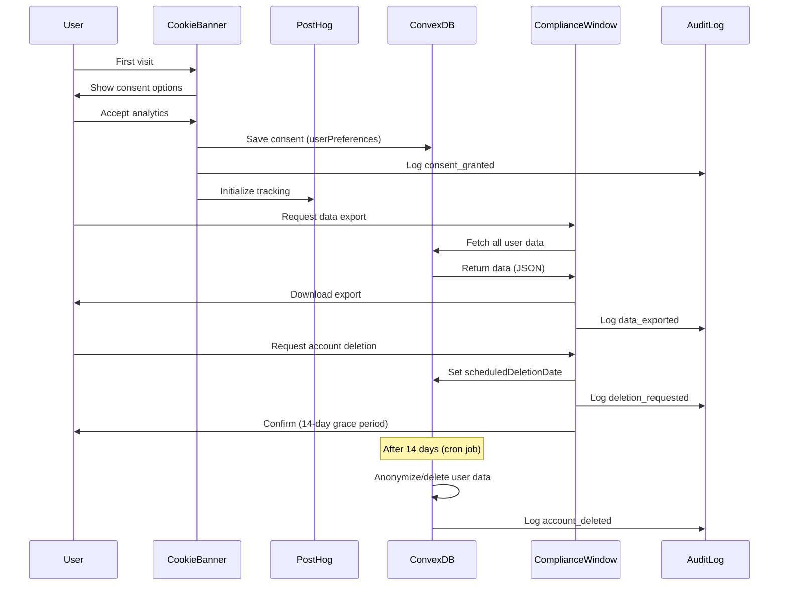
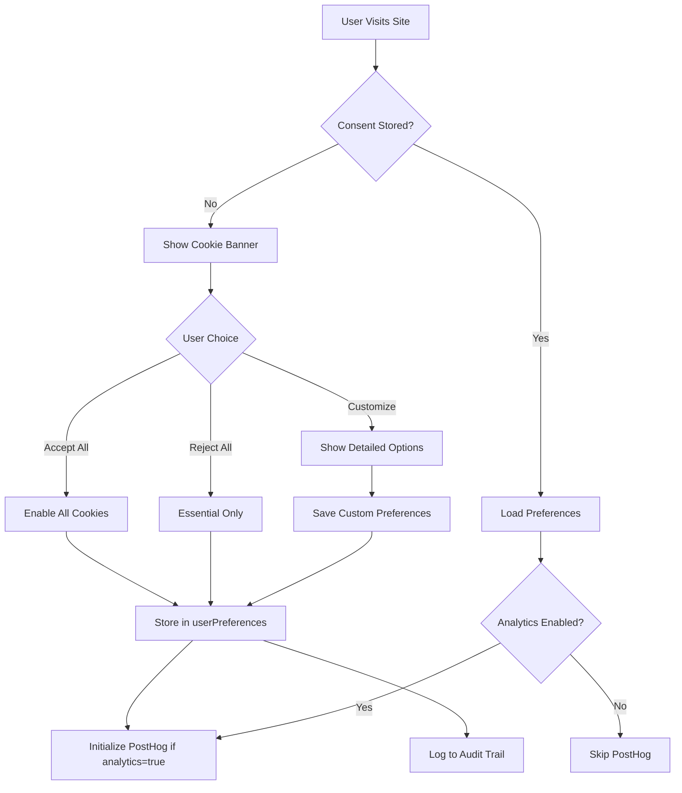

I have created the following plan after thorough exploration and analysis of the codebase. Follow the below plan verbatim. Trust the files and references. Do not re-verify what's written in the plan. Explore only when absolutely necessary. First implement all the proposed file changes and then I'll review all the changes together at the end.

## Observations

Your platform already has strong GDPR foundations: data export, account deletion with grace period, EU-hosted PostHog analytics, audit logging, and RBAC. The compliance window provides essential user rights (data portability, right to erasure). However, critical user-facing elements are missing: cookie consent management, privacy policy, terms of service, and comprehensive consent tracking for third-party services (PostHog, Stripe, Resend).

## Approach

The implementation follows a layered approach prioritizing user-facing compliance first (cookie consent, privacy policy, terms), then backend enhancements (consent tracking, data retention policies, breach notification), and finally documentation (DPA templates, ROPA, subprocessor list). This ensures immediate legal compliance while building robust internal processes. All features integrate with existing systems (Convex schema, ontology, audit logs) to maintain architectural consistency.

---

## Implementation Plan

### Phase 1: Cookie Consent & User-Facing Legal Documents

#### 1.1 Cookie Consent Banner Component

Create `file:src/components/gdpr/cookie-consent-banner.tsx`:
- Display banner on first visit with clear explanation of cookie usage
- Categorize cookies: Essential (always on), Analytics (PostHog), Marketing (future)
- Provide granular consent controls with toggle switches
- Store consent preferences in `userPreferences` table (new field: `cookieConsent`)
- Implement "Accept All", "Reject All", and "Customize" options
- Show banner at bottom of screen with Win95 styling
- Include link to cookie policy
- Respect user's previous choices on subsequent visits

Update `file:convex/schemas/coreSchemas.ts`:
- Add `cookieConsent` field to `userPreferences` table:
  ```typescript
  cookieConsent: v.optional(v.object({
    essential: v.boolean(),      // Always true
    analytics: v.boolean(),       // PostHog
    marketing: v.boolean(),       // Future use
    timestamp: v.number(),        // When consent was given
    version: v.string(),          // Policy version accepted
  }))
  ```

Create `file:convex/userPreferences.ts` mutations:
- `updateCookieConsent` - Save user's cookie preferences
- `getCookieConsent` - Retrieve user's current consent settings

#### 1.2 Privacy Policy Page

Create `file:src/app/privacy/page.tsx`:
- Comprehensive privacy policy covering:
  - Data controller information (company name, address, DPO contact)
  - Types of personal data collected (email, name, organization data, usage data)
  - Legal basis for processing (contract, consent, legitimate interest)
  - Purpose of data collection (service delivery, analytics, billing)
  - Data retention periods (active accounts, deleted accounts grace period)
  - Third-party services and data sharing (PostHog, Stripe, Resend, Convex)
  - User rights (access, rectification, erasure, portability, objection)
  - International data transfers (EU/US, Standard Contractual Clauses)
  - Cookie usage and consent management
  - Data security measures
  - Contact information for privacy inquiries
- Use markdown format with clear sections and table of contents
- Include last updated date and version number
- Make accessible from footer and cookie consent banner
- Support multi-language using existing translation system

#### 1.3 Terms of Service Page

Create `file:src/app/terms/page.tsx`:
- Cover essential legal terms:
  - Service description and scope
  - User obligations and acceptable use
  - Account registration and security
  - Subscription and payment terms
  - Intellectual property rights
  - Limitation of liability
  - Termination and suspension
  - Dispute resolution and governing law
  - Changes to terms
- Link to privacy policy
- Include effective date and version number
- Support multi-language translations

#### 1.4 Cookie Policy Page

Create `file:src/app/cookies/page.tsx`:
- Detailed explanation of cookie usage:
  - What cookies are and why they're used
  - Types of cookies used (session, persistent, third-party)
  - Specific cookies by category (essential, analytics, marketing)
  - Cookie lifespan and data collected
  - How to manage cookie preferences
  - Browser-level cookie controls
- Link back to privacy policy and consent banner
- Include cookie table with name, purpose, duration, type

#### 1.5 Footer Legal Links

Update `file:src/components/layout/footer.tsx` (or create if missing):
- Add links to Privacy Policy, Terms of Service, Cookie Policy
- Include company legal information (name, registration number, address)
- Add DPO contact email
- Display copyright notice
- Ensure footer is visible on all pages

---

### Phase 2: Consent Management & Analytics Integration

#### 2.1 PostHog Consent Integration

Update `file:src/components/providers/posthog-provider.tsx`:
- Check user's cookie consent before initializing PostHog
- Only initialize if `cookieConsent.analytics === true`
- Provide opt-out mechanism that disables PostHog tracking
- Implement consent change listener to enable/disable tracking dynamically
- Use PostHog's `opt_out_capturing()` and `opt_in_capturing()` methods
- Ensure no tracking occurs before consent is given (GDPR requirement)

Create `file:src/hooks/use-cookie-consent.ts`:
- Hook to access and update cookie consent state
- Trigger PostHog enable/disable based on consent changes
- Provide loading state while consent is being fetched

#### 2.2 Consent Tracking Schema

Create `file:convex/schemas/consentSchemas.ts`:
- Define `consentRecords` table:
  ```typescript
  consentRecords: defineTable({
    userId: v.id("users"),
    consentType: v.union(
      v.literal("cookie_analytics"),
      v.literal("cookie_marketing"),
      v.literal("email_marketing"),
      v.literal("data_processing")
    ),
    granted: v.boolean(),
    timestamp: v.number(),
    ipAddress: v.optional(v.string()),
    userAgent: v.optional(v.string()),
    policyVersion: v.string(),
    source: v.string(), // "cookie_banner", "settings", "signup"
  })
  .index("by_user", ["userId"])
  .index("by_user_type", ["userId", "consentType"])
  ```

Update `file:convex/schema.ts`:
- Import and add `consentRecords` table

Create `file:convex/consent.ts`:
- `recordConsent` mutation - Log consent decisions with audit trail
- `getConsentHistory` query - Retrieve user's consent history
- `revokeConsent` mutation - Allow users to withdraw consent

#### 2.3 Privacy Settings in User Profile

Update `file:src/components/window-content/user-settings-window.tsx`:
- Add "Privacy & Data" tab
- Display current cookie consent settings with toggle switches
- Show consent history (when granted, policy version)
- Provide "Download My Data" button (links to compliance window)
- Provide "Delete My Account" button (links to compliance window)
- Show data retention information
- Display list of third-party services with data access

---

### Phase 3: Data Retention & Deletion Policies

#### 3.1 Data Retention Policy Documentation

Create `file:docs/DATA_RETENTION_POLICY.md`:
- Define retention periods for each data type:
  - Active user accounts: Indefinite (while account is active)
  - Deleted accounts: 14-day grace period, then permanent deletion
  - Audit logs: 2 years (compliance requirement)
  - Session data: 30 days after expiration
  - Analytics data: 26 months (PostHog default)
  - Payment records: 10 years (tax compliance)
  - Email logs: 90 days
  - Temporary OAuth states: 15 minutes
- Document legal basis for each retention period
- Include process for data deletion after retention period

#### 3.2 Automated Data Cleanup Jobs

Create `file:convex/crons.ts` (or update existing):
- Add scheduled job to delete expired sessions (daily)
- Add job to delete expired OAuth states (hourly)
- Add job to delete old audit logs after 2 years (weekly)
- Add job to anonymize deleted user data after grace period
- Ensure jobs log their actions to audit trail

Update `file:convex/accountManagement.ts`:
- Enhance `permanentlyDeleteExpiredAccounts` to also delete:
  - User sessions
  - User preferences
  - Consent records (or anonymize)
  - OAuth connections
  - API keys
  - Passkeys
  - Audit logs (or anonymize userId)

#### 3.3 Data Anonymization Utilities

Create `file:convex/lib/anonymization.ts`:
- `anonymizeUser` function - Replace PII with anonymized values
- `anonymizeAuditLogs` - Replace userId with "DELETED_USER_{hash}"
- `anonymizeEmail` - Replace email with "deleted_{hash}@example.com"
- Preserve data structure for analytics while removing PII

---

### Phase 4: Data Breach Notification System

#### 4.1 Security Events Schema

Update `file:convex/schemas/securitySchemas.ts`:
- Add `dataBreaches` table:
  ```typescript
  dataBreaches: defineTable({
    organizationId: v.id("organizations"),
    detectedAt: v.number(),
    reportedAt: v.optional(v.number()),
    breachType: v.string(), // "unauthorized_access", "data_leak", "system_compromise"
    severity: v.union(v.literal("low"), v.literal("medium"), v.literal("high"), v.literal("critical")),
    affectedUsers: v.array(v.id("users")),
    affectedDataTypes: v.array(v.string()), // ["email", "name", "payment_info"]
    description: v.string(),
    mitigationSteps: v.array(v.string()),
    notifiedAuthority: v.boolean(),
    notifiedUsers: v.boolean(),
    status: v.union(v.literal("detected"), v.literal("investigating"), v.literal("contained"), v.literal("resolved")),
    resolvedAt: v.optional(v.number()),
  })
  .index("by_organization", ["organizationId"])
  .index("by_status", ["status"])
  ```

Create `file:convex/security/breachNotification.ts`:
- `reportBreach` mutation - Log security breach
- `notifyAuthority` action - Send notification to supervisory authority (email template)
- `notifyAffectedUsers` action - Send breach notification emails to users
- `updateBreachStatus` mutation - Track breach resolution progress

#### 4.2 Breach Notification Email Templates

Create `file:convex/emailTemplates/breachNotification.ts`:
- Template for user notification (clear, non-technical language)
- Include: what happened, what data was affected, what we're doing, what users should do
- Template for authority notification (detailed technical report)

---

### Phase 5: Legal Documentation & Compliance Tools

#### 5.1 Data Processing Agreement (DPA) Template

Create `file:docs/legal/DPA_TEMPLATE.md`:
- Standard DPA template for customers
- Cover: roles and responsibilities, data processing instructions, security measures, subprocessors, data subject rights, breach notification, audit rights
- Include appendices: data categories, processing purposes, retention periods
- Make available for download in compliance window

Update `file:src/components/window-content/compliance-window.tsx`:
- Add "Legal Documents" tab
- Provide downloadable DPA template (PDF generation)
- Show list of subprocessors with links to their privacy policies

#### 5.2 Records of Processing Activities (ROPA)

Create `file:convex/compliance/ropa.ts`:
- `generateROPA` action - Generate ROPA document
- Include: processing activities, purposes, data categories, recipients, retention periods, security measures
- Export as JSON or PDF

Create `file:docs/legal/ROPA.md`:
- Document all processing activities:
  - User authentication and account management
  - Payment processing (Stripe)
  - Email delivery (Resend)
  - Analytics (PostHog)
  - File storage (Convex)
  - CRM data management
  - AI processing
- For each activity: purpose, legal basis, data categories, recipients, retention, security

#### 5.3 Subprocessor List

Create `file:docs/legal/SUBPROCESSORS.md`:
- List all third-party services that process personal data:
  - Convex (database, file storage) - US/EU
  - Stripe (payment processing) - US/EU
  - Resend (email delivery) - US
  - PostHog (analytics) - EU
  - Vercel (hosting) - US/EU
- For each: name, purpose, location, data processed, privacy policy link, safeguards (SCCs, DPF)
- Include process for notifying customers of new subprocessors

#### 5.4 International Data Transfer Documentation

Create `file:docs/legal/DATA_TRANSFERS.md`:
- Document all international data transfers
- Identify transfer mechanisms (Standard Contractual Clauses, Data Privacy Framework)
- List countries where data is processed
- Document safeguards for each transfer
- Include copies of SCCs or DPF certification

---

### Phase 6: User Rights Implementation Enhancements

#### 6.1 Enhanced Data Export

Update `file:convex/compliance.ts`:
- Enhance `exportUserData` to include:
  - All user profile data
  - Organization memberships and roles
  - CRM contacts and organizations
  - Invoices and transactions
  - Media files (metadata + download links)
  - Workflows and automation
  - Templates and projects
  - Audit logs (user's own actions)
  - Consent history
  - API keys (masked)
  - OAuth connections (without tokens)
- Export in machine-readable JSON format
- Include data dictionary explaining each field
- Provide option to export as CSV for non-technical users

#### 6.2 Data Rectification Interface

Create `file:src/components/window-content/compliance-window/data-rectification-tab.tsx`:
- Allow users to view and correct their personal data
- Show current values for: name, email, organization info, preferences
- Provide inline editing with validation
- Log all changes to audit trail
- Require re-authentication for sensitive changes (email)

#### 6.3 Right to Object

Create `file:convex/compliance/objections.ts`:
- `recordObjection` mutation - Log user objections to processing
- Support objection types: marketing, profiling, automated decision-making
- Automatically disable relevant processing when objection is recorded
- Notify administrators of objections requiring manual review

---

### Phase 7: Compliance Monitoring & Reporting

#### 7.1 Compliance Dashboard

Create `file:src/components/window-content/compliance-dashboard-window.tsx`:
- Admin-only window showing compliance metrics:
  - Total users with active consent
  - Consent opt-in rates by type
  - Data export requests (count, average response time)
  - Account deletion requests (count, status)
  - Data breach incidents (count, status)
  - Subprocessor changes (recent additions)
  - ROPA last updated date
- Display charts using existing UI components
- Provide export functionality for compliance reports

#### 7.2 Audit Log Enhancements

Update `file:convex/schemas/utilitySchemas.ts`:
- Add GDPR-specific audit events:
  - `consent_granted`, `consent_revoked`
  - `data_exported`, `data_rectified`
  - `account_deletion_requested`, `account_deleted`
  - `privacy_policy_viewed`, `terms_accepted`
  - `breach_detected`, `breach_notified`

Update `file:convex/rbac.ts`:
- Ensure all GDPR-related actions are logged
- Include IP address and user agent for consent events
- Retain audit logs for 2 years minimum

#### 7.3 Compliance Checklist

Create `file:src/components/window-content/compliance-window/compliance-checklist-tab.tsx`:
- Interactive checklist for administrators:
  - ✅ Privacy policy published and up-to-date
  - ✅ Cookie consent banner implemented
  - ✅ Data export functionality tested
  - ✅ Account deletion process verified
  - ✅ DPA template available
  - ✅ Subprocessor list current
  - ✅ ROPA documented
  - ✅ Breach notification process tested
  - ✅ Staff trained on GDPR
  - ✅ DPO appointed (if required)
- Show completion percentage
- Link to relevant documentation for each item

---

### Phase 8: Testing & Validation

#### 8.1 GDPR Compliance Tests

Create `file:tests/gdpr/cookie-consent.test.ts`:
- Test cookie consent banner display on first visit
- Test consent preferences are saved correctly
- Test PostHog initialization respects consent
- Test consent withdrawal disables tracking

Create `file:tests/gdpr/data-export.test.ts`:
- Test data export includes all required data
- Test export format is machine-readable
- Test export completes within 30 days (simulate)

Create `file:tests/gdpr/account-deletion.test.ts`:
- Test deletion request creates grace period
- Test account restoration during grace period
- Test permanent deletion after grace period
- Test all related data is deleted/anonymized

Create `file:tests/gdpr/user-rights.test.ts`:
- Test data rectification updates are applied
- Test objections are recorded and processed
- Test consent history is accurate

#### 8.2 Security Testing

- Penetration testing for data access controls
- Verify encryption at rest and in transit
- Test session management and timeout
- Validate API key scoping and permissions
- Review third-party service security configurations

---

### Phase 9: Documentation & Training

#### 9.1 Internal Documentation

Create `file:docs/GDPR_COMPLIANCE_GUIDE.md`:
- Overview of GDPR requirements
- Platform's compliance approach
- Roles and responsibilities
- Incident response procedures
- Regular compliance review schedule
- Contact information for DPO and legal team

Create `file:docs/DATA_SUBJECT_REQUESTS.md`:
- Step-by-step guide for handling DSRs
- Templates for response emails
- Timelines and deadlines
- Escalation procedures

#### 9.2 User-Facing Help Documentation

Create `file:docs/help/PRIVACY_CONTROLS.md`:
- How to manage cookie preferences
- How to export your data
- How to delete your account
- How to update your information
- How to contact support for privacy questions

#### 9.3 Staff Training Materials

Create `file:docs/training/GDPR_TRAINING.md`:
- GDPR basics for all staff
- Data handling best practices
- Recognizing and reporting security incidents
- Responding to data subject requests
- Quiz to verify understanding

---

### Phase 10: Ongoing Compliance

#### 10.1 Regular Reviews

Establish schedule for:
- Quarterly privacy policy review and updates
- Annual ROPA update
- Bi-annual security audits
- Monthly subprocessor list review
- Weekly compliance dashboard review

#### 10.2 Change Management

Create process for:
- Notifying users of privacy policy changes (email + banner)
- Obtaining renewed consent when required
- Notifying customers of new subprocessors (30 days advance notice)
- Updating legal documentation when features change

#### 10.3 Continuous Monitoring

Implement:
- Automated alerts for unusual data access patterns
- Regular penetration testing schedule
- Third-party security assessments
- Compliance software integration (optional)

---

## Technical Architecture Diagram



---

## Data Flow for Cookie Consent



---

## Compliance Checklist Summary

| Category | Items | Status |
|----------|-------|--------|
| **User Rights** | Data export, deletion, rectification, portability | ✅ Partially implemented |
| **Consent** | Cookie banner, analytics opt-in, consent tracking | ❌ Not implemented |
| **Transparency** | Privacy policy, terms, cookie policy | ❌ Not implemented |
| **Security** | Encryption, access controls, breach notification | ✅ Partially implemented |
| **Documentation** | DPA, ROPA, subprocessor list, data transfers | ❌ Not implemented |
| **Data Retention** | Policies, automated cleanup, anonymization | ✅ Partially implemented |
| **Monitoring** | Audit logs, compliance dashboard, alerts | ✅ Partially implemented |

---

## Priority Implementation Order

1. **Critical (Week 1-2):** Cookie consent banner, privacy policy, terms of service
2. **High (Week 3-4):** Consent tracking, PostHog integration, data retention policies
3. **Medium (Week 5-6):** DPA template, subprocessor list, enhanced data export
4. **Low (Week 7-8):** Compliance dashboard, ROPA, breach notification system
5. **Ongoing:** Testing, documentation, staff training, regular reviews