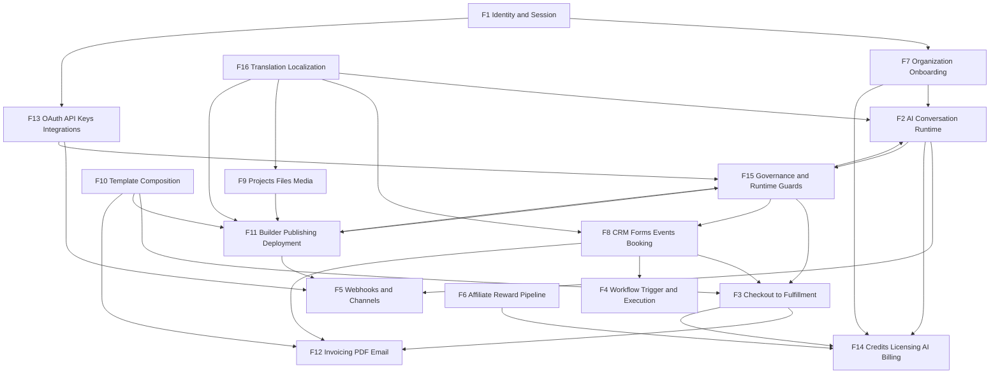

# System Landscape

Purpose:
- provide one high-level visual map of how major runtime flows connect
- complement per-flow sequence docs (`flows/F*.md`)

## Platform Runtime Map

## Reading Guide

1. Use this file for system-level orientation.
2. Use `FLOW_CATALOG.md` for entry points and anchor files.
3. Use `flows/F*.md` for execution details and invariants.
