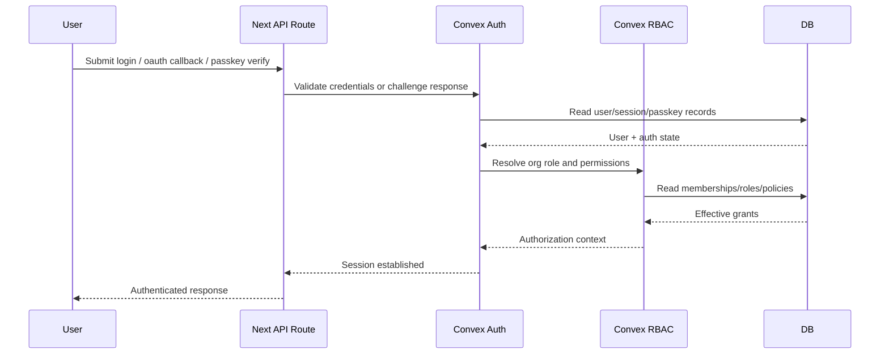

# F1 - Identity and Session Lifecycle

## Intent

Authenticate users (password, OAuth, passkeys), establish session context, and enforce authorization.

## Entry points

- `src/app/api/auth/*`
- `src/app/api/passkeys/*`
- `src/app/api/oauth/*`

## Primary anchors

- `convex/auth.ts`
- `convex/passkeys.ts`
- `convex/portalAuth.ts`
- `convex/rbac.ts`
- `convex/rbacQueries.ts`

## Sequence

## Invariants

1. Authentication and authorization remain separate concerns.
2. Session creation must produce org-aware permission context.
3. Passkey flows must verify challenge before session issuance.
