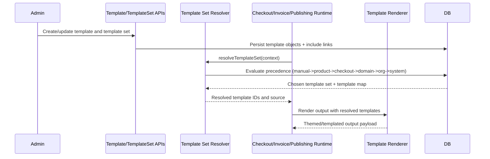

# F10 - Template Composition and Resolution

## Intent

Create reusable templates/template sets and resolve the correct template composition at runtime with deterministic precedence.

## Entry points

- Template management calls in `convex/templateOntology.ts` and `convex/templateSetOntology.ts`
- Runtime resolution via `convex/templateSetResolver.ts`

## Primary anchors

- `convex/templateOntology.ts`
- `convex/templateSetOntology.ts`
- `convex/templateSetResolver.ts`
- `src/templates/registry.ts`

## Sequence

## Invariants

1. Resolution precedence is deterministic and auditable.
2. Legacy v1 template-set fields remain backward compatible.
3. Missing org defaults must fall back to system defaults.
