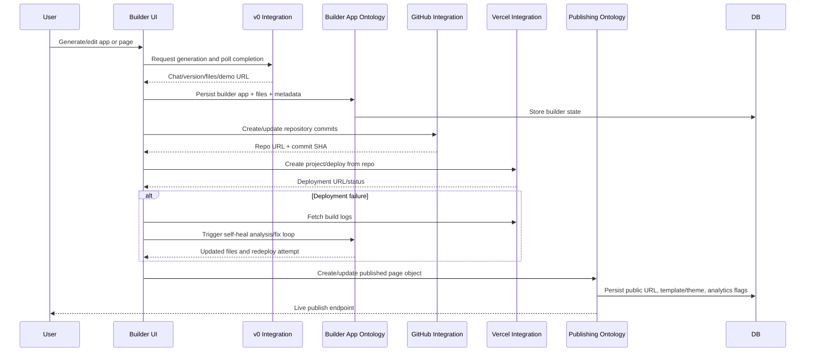

# F11 - Builder, Publishing, and Deployment

## Intent

Transform generated or edited app/page content into deployed experiences via builder state, GitHub/Vercel integrations, and published page objects.

## Entry points

- Builder surfaces: `src/app/builder/*`
- Publishing APIs: `convex/api/v1/publishing.ts`
- Integrations: `convex/integrations/v0.ts`, `convex/integrations/github.ts`, `convex/integrations/vercel.ts`

## Primary anchors

- `convex/builderAppOntology.ts`
- `convex/integrations/v0.ts`
- `convex/integrations/github.ts`
- `convex/integrations/vercel.ts`
- `convex/integrations/selfHealDeploy.ts`
- `convex/publishingOntology.ts`

## Sequence

## Invariants

1. Builder file state is the source of truth for generated app content.
2. Deployment status transitions must be explicit (`deploying`, `deployed`, `failed`).
3. Publishing records must maintain traceability to linked source objects.
