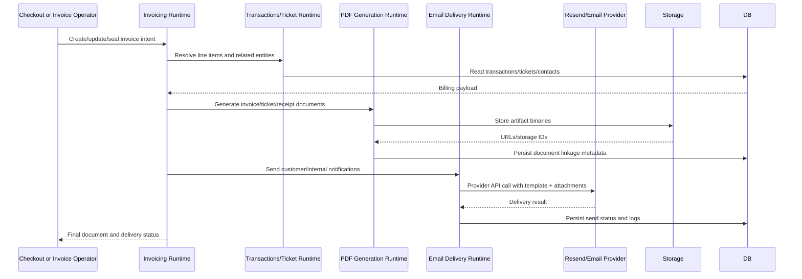

# F12 - Invoicing, PDF Generation, and Email Delivery

## Intent

Convert transactional domain data into invoices/tickets, generate document artifacts, and deliver them through configured email channels.

## Entry points

- `convex/api/v1/invoices.ts`
- Checkout completion hooks in `convex/checkoutSessions.ts`
- Email send actions in `convex/emailDelivery.ts`

## Primary anchors

- `convex/invoicingOntology.ts`
- `convex/consolidatedInvoicing.ts`
- `convex/pdfGeneration.ts`
- `convex/ticketGeneration.ts`
- `convex/emailDelivery.ts`
- `convex/ticketEmailService.ts`

## Sequence

## Invariants

1. Invoice sealing rules must prevent mutable financial history after sealing.
2. Document generation failures must surface explicit error state, not silent success.
3. Email delivery should be retry-aware and track attempts/results.
