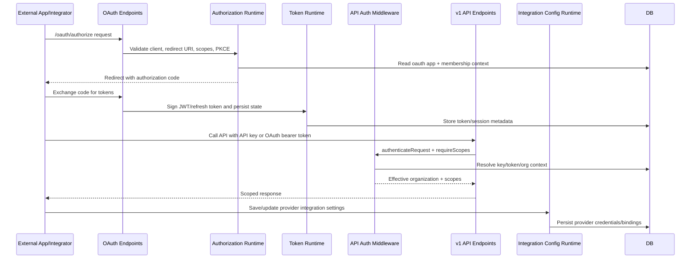

# F13 - OAuth, API Keys, and Integration Authorization

## Intent

Authorize external clients and platform integrations, issue scoped credentials, and enforce scoped access across API operations.

## Entry points

- OAuth endpoints in `convex/oauth/endpoints.ts`
- API auth middleware in `convex/middleware/auth.ts`
- Integration settings in `convex/integrations/*`

## Primary anchors

- `convex/oauth/authorize.ts`
- `convex/oauth/tokens.ts`
- `convex/oauth/endpoints.ts`
- `convex/apiKeysInternal.ts`
- `convex/middleware/auth.ts`
- `convex/organizationApiSettings.ts`

## Sequence

## Invariants

1. OAuth authorization must validate redirect URIs and allowed scopes before code issuance.
2. API request handling must apply scope checks after authentication, never before.
3. Integration credentials must remain organization-scoped and auditable.
