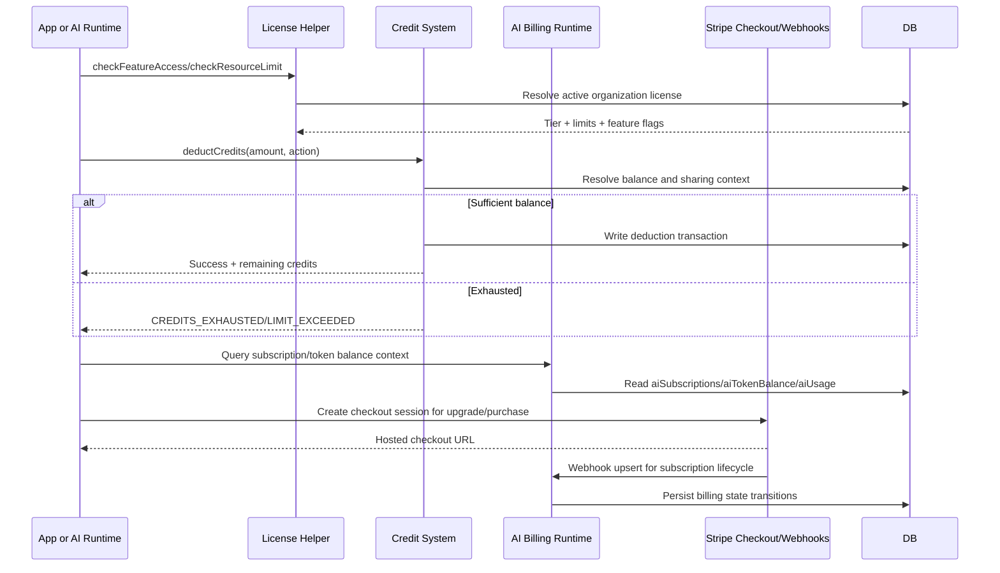

# F14 - Credits, Licensing, and AI Billing

## Intent

Enforce plan limits and credit economics while synchronizing paid billing state (Stripe + AI subscriptions) with runtime consumption.

## Entry points

- Credit deduction in `convex/credits/index.ts`
- License checks in `convex/licensing/helpers.ts`
- AI billing checkout/webhooks in `convex/stripe/aiCheckout.ts` and `convex/stripe/aiWebhooks.ts`

## Primary anchors

- `convex/credits/index.ts`
- `convex/licensing/helpers.ts`
- `convex/ai/billing.ts`
- `convex/stripe/aiCheckout.ts`
- `convex/stripe/aiWebhooks.ts`

## Sequence

## Invariants

1. License checks must happen before resource creation/mutation side effects.
2. Credit deduction order and transaction logs must be deterministic.
3. Stripe webhook updates must be idempotent for subscription state transitions.
