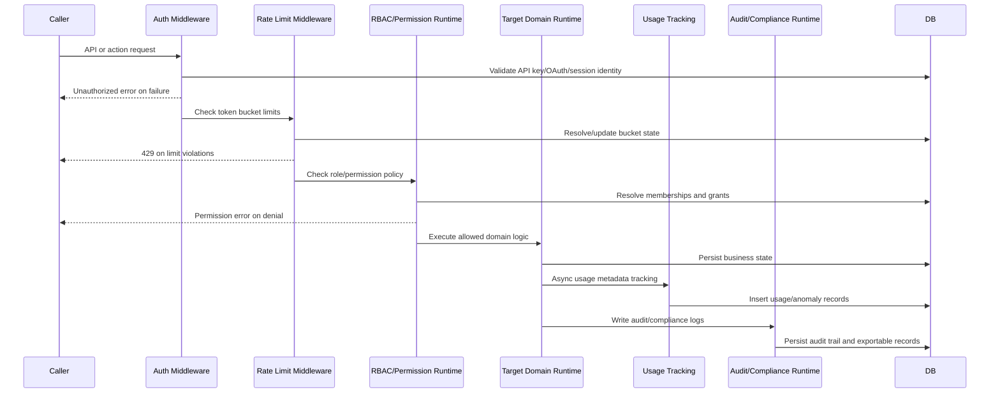

# F15 - Governance, Audit, and Runtime Guards

## Intent

Apply security and governance controls (RBAC, rate limiting, usage telemetry, audit logging, compliance outputs) around all critical runtime operations.

## Entry points

- API and runtime middleware (`convex/middleware/*`)
- RBAC and permission checks (`convex/rbac*.ts`)
- Compliance/audit modules (`convex/compliance.ts`, `convex/auditLogExport.ts`)

## Primary anchors

- `convex/middleware/auth.ts`
- `convex/middleware/rateLimit.ts`
- `convex/rbac.ts`
- `convex/security/usageTracking.ts`
- `convex/auditLogExport.ts`
- `convex/compliance.ts`

## Sequence

## Invariants

1. Authentication, rate limit, and permission checks execute in that order.
2. Guard failures return explicit errors and block domain mutations.
3. Governance telemetry/audit writes must be append-only and organization-scoped.
