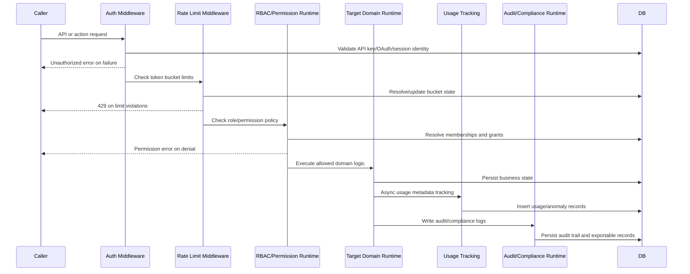

# F15 - Governance, Audit, and Runtime Guards

## Intent

Apply security and governance controls (RBAC, rate limiting, usage telemetry, audit logging, compliance outputs) around all critical runtime operations.

## Entry points

- API and runtime middleware (`convex/middleware/*`)
- RBAC and permission checks (`convex/rbac*.ts`)
- Compliance/audit modules (`convex/compliance.ts`, `convex/auditLogExport.ts`)

## Primary anchors

- `convex/middleware/auth.ts`
- `convex/middleware/rateLimit.ts`
- `convex/rbac.ts`
- `convex/security/usageTracking.ts`
- `convex/auditLogExport.ts`
- `convex/compliance.ts`
- `convex/complianceControlPlane.ts`

## Sequence

```mermaid
sequenceDiagram
    participant Caller
    participant Auth as Auth Middleware
    participant Limit as Rate Limit Middleware
    participant RBAC as RBAC/Permission Runtime
    participant Domain as Target Domain Runtime
    participant Usage as Usage Tracking
    participant Audit as Audit/Compliance Runtime
    participant DB

    Caller->>Auth: API or action request
    Auth->>DB: Validate API key/OAuth/session identity
    Auth-->>Caller: Unauthorized error on failure

    Auth->>Limit: Check token bucket limits
    Limit->>DB: Resolve/update bucket state
    Limit-->>Caller: 429 on limit violations

    Limit->>RBAC: Check role/permission policy
    RBAC->>DB: Resolve memberships and grants
    RBAC-->>Caller: Permission error on denial

    RBAC->>Domain: Execute allowed domain logic
    Domain->>DB: Persist business state

    Domain->>Usage: Async usage metadata tracking
    Usage->>DB: Insert usage/anomaly records
    Domain->>Audit: Write audit/compliance logs
    Audit->>DB: Persist audit trail and exportable records
```

## Invariants

1. Authentication, rate limit, and permission checks execute in that order.
2. Guard failures return explicit errors and block domain mutations.
3. Governance telemetry/audit writes must be append-only and organization-scoped.
4. Compliance operational telemetry uses deterministic severity ranking (`critical` > `warning` > `info`) and stable alert codes.
5. Compliance gate posture stays fail-closed when gate status is `NO_GO` or any critical operational alert is active.

## Compliance operational telemetry contract (DCAF-035)

`convex/complianceControlPlane.ts` now emits `compliance_operational_telemetry_v1` snapshots on org/fleet governance reads, including:

1. Gate transition telemetry
2. Outreach stall detection (`R-002`)
3. Evidence review/retention expiry windows (`R-003`..`R-005`)
4. Deterministic alert bundles (`gate_transition`, `outreach_stalled`, `evidence_review_due_soon`, `evidence_review_overdue`, `evidence_retention_expiring_soon`, `evidence_retention_expired`, `invalid_evidence_metadata`)

Operational thresholds are runtime constants:

1. Outreach stall threshold: 72 hours
2. Evidence warning window: 14 days

Owner gate mutations also persist gate transition telemetry events (`compliance_gate_transition_telemetry`) in `objectActions` with from/to effective status and owner decision states.
