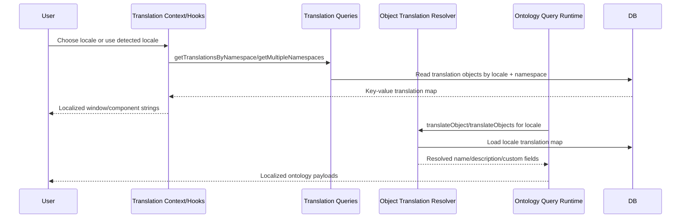

# F16 - Translation and Localization Delivery

## Intent

Resolve language-specific strings for UI and ontology content using namespace-scoped translation loading and runtime object translation.

## Entry points

- `src/contexts/translation-context.tsx`
- `src/hooks/use-namespace-translations.ts`
- `convex/ontologyTranslations.ts`

## Primary anchors

- `convex/ontologyTranslations.ts`
- `convex/translationResolver.ts`
- `convex/translations/*`
- `src/contexts/translation-context.tsx`
- `src/hooks/use-namespace-translations.ts`

## Sequence

## Invariants

1. Namespace-scoped translation queries prevent oversized payloads.
2. Missing translations must fail soft (key fallback), not crash runtime.
3. Translation objects remain system-scoped and locale-indexed.
