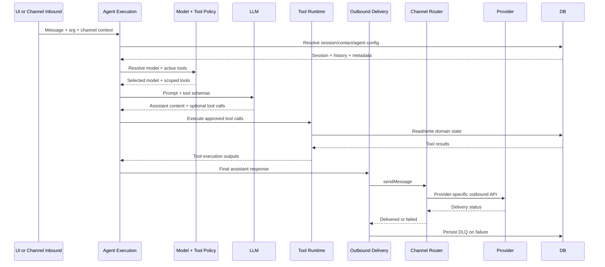

# F2 - AI Conversation Runtime

## Intent

Process inbound user/channel messages through policy-driven model and tool execution, then deliver outbound responses.

## Entry points

- `convex/ai/chat.ts` (`sendMessage`)
- `convex/ai/agentExecution.ts` (`processInboundMessage`)

## Primary anchors

- `convex/ai/modelPolicy.ts`
- `convex/ai/retryPolicy.ts`
- `convex/ai/toolScoping.ts`
- `convex/ai/toolBroker.ts`
- `convex/ai/outboundDelivery.ts`
- `convex/channels/router.ts`

## Sequence

## Invariants

1. Tool access is resolved with most-restrictive-wins scoping.
2. Model selection is policy-driven, not hardcoded per flow.
3. Outbound failure must not silently drop messages; DLQ fallback is required.
