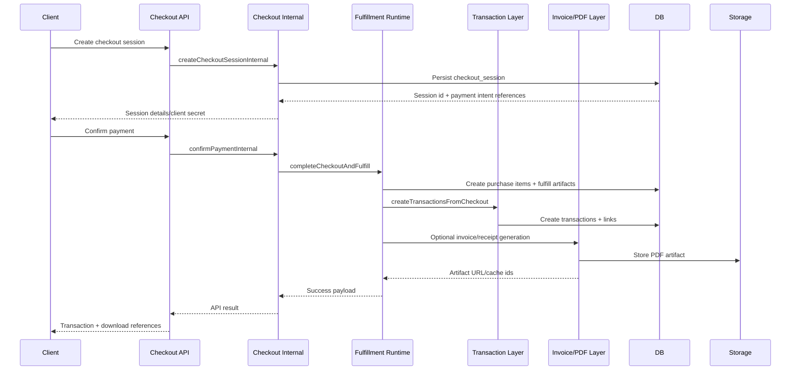

# F3 - Checkout to Fulfillment

## Intent

Turn a checkout payment confirmation into fulfilled purchase items, transactions, and invoice/receipt artifacts.

## Entry points

- `POST /api/v1/checkout/sessions`
- `POST /api/v1/checkout/confirm`

## Primary anchors

- `convex/api/v1/checkout.ts`
- `convex/api/v1/checkoutInternal.ts`
- `convex/checkoutSessions.ts` (`completeCheckoutAndFulfill`)
- `convex/createTransactionsFromCheckout.ts`
- `convex/transactionInvoicing.ts`

## Sequence

## Invariants

1. Fulfillment writes purchase items before transaction linking.
2. Transaction creation is synchronous in checkout completion path.
3. Invoice mode must respect payment path (employer/manual/free/receipt).
