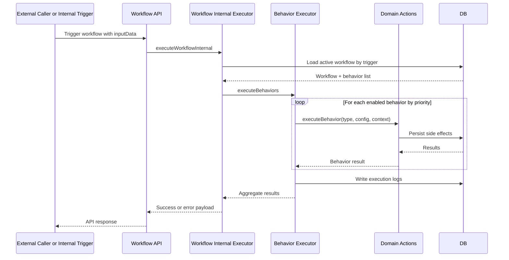

# F4 - Workflow Trigger and Behavior Execution

## Intent

Execute workflow definitions from triggers and run behavior actions in deterministic order.

## Entry points

- `POST /api/v1/workflows/trigger`
- Form and checkout trigger paths that route into workflow execution

## Primary anchors

- `convex/api/v1/workflows.ts`
- `convex/api/v1/workflowsInternal.ts`
- `convex/workflows/behaviorExecutor.ts`
- `convex/workflows/workflowExecution.ts`

## Sequence

## Invariants

1. Workflow selection requires active status and trigger match.
2. Behavior ordering follows declared priority.
3. Execution logs must capture per-behavior outcomes.
