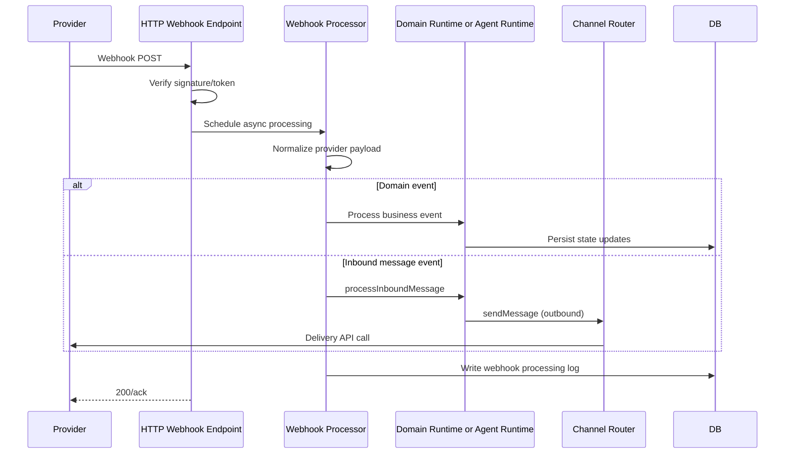

# F5 - External Webhooks and Channel Ingestion

## Intent

Receive provider webhooks, verify and normalize payloads, then route to domain handlers or agent pipeline.

## Entry points

- `/stripe-webhooks`
- `/stripe-connect-webhooks`
- `/telegram-webhook`
- other provider webhook paths in `convex/http.ts`

## Primary anchors

- `convex/http.ts`
- `convex/stripeWebhooks.ts`
- `convex/channels/webhooks.ts`
- `convex/channels/router.ts`

## Sequence

## Invariants

1. Webhook endpoints should return quickly; heavy work runs async.
2. Signature/token checks must happen before processing.
3. Message-channel webhooks route through the same outbound adapter path.
