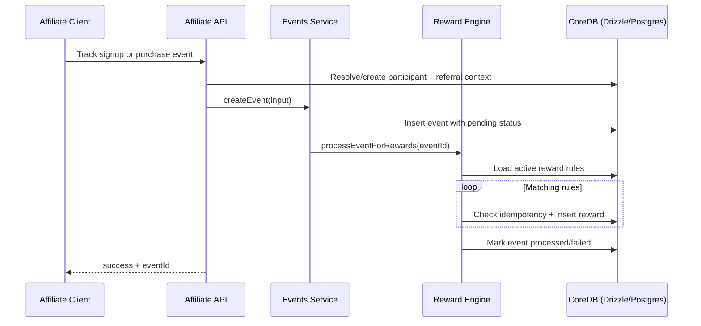

# F6 - Affiliate Event to Reward Pipeline

## Intent

Ingest affiliate tracking events and convert them into reward records through rule evaluation.

## Entry points

- `POST /v1/track/signup`
- `POST /v1/track/purchase`

## Primary anchors

- `services/affiliate/apps/api/src/routes/v1/track/signup.ts`
- `services/affiliate/apps/api/src/routes/v1/track/purchase.ts`
- `services/affiliate/apps/api/src/services/events.ts`
- `services/affiliate/apps/api/src/services/reward-engine.ts`

## Sequence

## Invariants

1. Event creation validates event definition and participant integrity.
2. Reward generation is idempotent per event/rule/participant.
3. Event status tracks processing outcome (`pending`, `processed`, `failed`).
