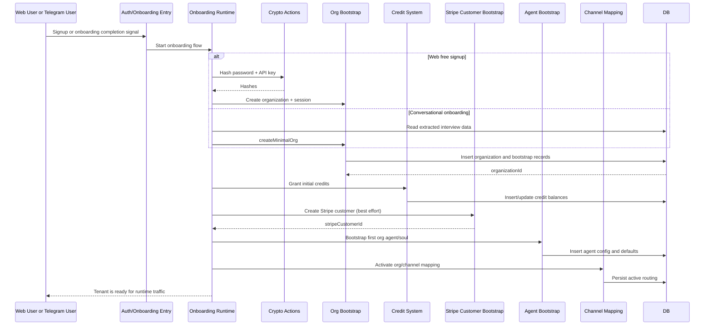

# F7 - Organization Onboarding and Bootstrap

## Intent

Create a net-new organization from signup or onboarding conversations, seed core runtime state, and hand control to the tenant-scoped agent/runtime.

## Entry points

- `src/app/api/auth/oauth-signup/route.ts`
- `convex/onboarding.ts` (`signupFreeAccount`)
- `convex/onboarding/completeOnboarding.ts` (`run`)

## Primary anchors

- `convex/onboarding.ts`
- `convex/onboarding/orgBootstrap.ts`
- `convex/onboarding/completeOnboarding.ts`
- `convex/onboarding/telegramResolver.ts`
- `convex/organizationOntology.ts`
- `convex/credits/index.ts`

## Sequence

## Invariants

1. Organization bootstrap must complete before tenant-scoped agent routing activates.
2. Initial credit and billing state must be provisioned idempotently.
3. Onboarding failures must not leave partially active routing.
