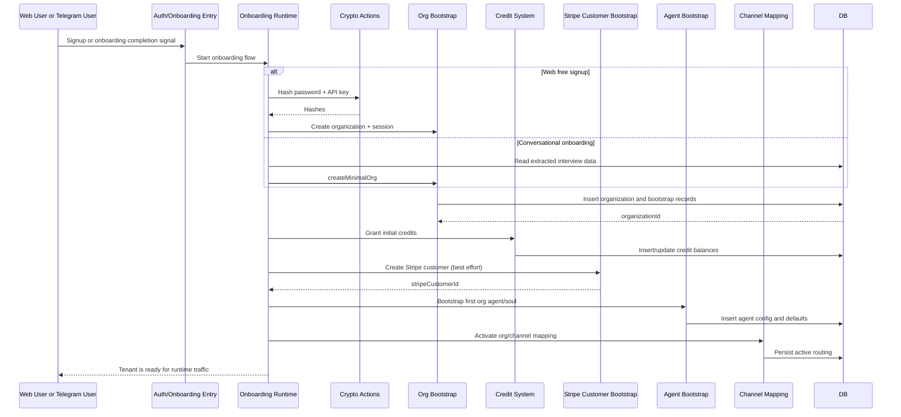

# F7 - Organization Onboarding and Bootstrap

## Intent

Create a net-new organization from signup or onboarding conversations, seed core runtime state, and hand control to the tenant-scoped agent/runtime.

## Entry points

- `src/app/api/auth/oauth-signup/route.ts`
- `convex/onboarding.ts` (`signupFreeAccount`)
- `convex/onboarding/completeOnboarding.ts` (`run`)
- `convex/http.ts` (`POST /api/v1/native-guest/message`, `POST /api/v1/webchat/message`)

## Primary anchors

- `convex/onboarding.ts`
- `convex/onboarding/orgBootstrap.ts`
- `convex/onboarding/completeOnboarding.ts`
- `convex/onboarding/identityClaims.ts`
- `convex/onboarding/universalOnboardingPolicy.ts`
- `convex/api/v1/webchatApi.ts`
- `convex/onboarding/telegramResolver.ts`
- `convex/organizations.ts`
- `convex/credits/index.ts`

## Sequence

```mermaid
sequenceDiagram
    participant User as Web User or Telegram User
    participant Entry as Auth/Onboarding Entry
    participant Onboarding as Onboarding Runtime
    participant Crypto as Crypto Actions
    participant Org as Org Bootstrap
    participant Credits as Credit System
    participant Billing as Stripe Customer Bootstrap
    participant Agent as Agent Bootstrap
    participant Routing as Channel Mapping
    participant DB

    User->>Entry: Signup or onboarding completion signal
    Entry->>Onboarding: Start onboarding flow
    alt Web free signup
        Onboarding->>Crypto: Hash password + API key
        Crypto-->>Onboarding: Hashes
        Onboarding->>Org: Create organization + session
    else Conversational onboarding
        Onboarding->>DB: Read extracted interview data
        Onboarding->>Org: createMinimalOrg
    end
    Org->>DB: Insert organization and bootstrap records
    DB-->>Org: organizationId
    Onboarding->>Credits: Grant initial credits
    Credits->>DB: Insert/update credit balances
    Onboarding->>Billing: Create Stripe customer (best effort)
    Billing-->>Onboarding: stripeCustomerId
    Onboarding->>Agent: Bootstrap first org agent/soul
    Agent->>DB: Insert agent config and defaults
    Onboarding->>Routing: Activate org/channel mapping
    Routing->>DB: Persist active routing
    Onboarding-->>User: Tenant is ready for runtime traffic
```

## Invariants

1. Organization bootstrap must complete before tenant-scoped agent routing activates.
2. Initial credit and billing state must be provisioned idempotently.
3. Onboarding failures must not leave partially active routing.
4. `finalizeOnboardingOrgClaim` is the only owner of `live_unclaimed_workspace -> claimed_workspace`.
5. Generic `guest_session_claim` semantics remain unchanged; onboarding-owned org claims are explicit and separate.

## Guest Binding Model

- Explicit onboarding-owned guest binding is tracked in `guestOnboardingBindings`.
- Explicit onboarding org claim tokens use `guest_onboarding_org_claim`.
- Binding creation is allowed only when an explicit onboarding surface discriminator resolves through `resolveExplicitGuestOnboardingSurface`.
- Current production onboarding-owned guest binding is limited to the one-of-one landing audit surface on `native_guest`.
- First touch creates or reuses a `provisional_onboarding` org shell.
- On onboarding completion, the same org is promoted to `live_unclaimed_workspace`.
- Authenticated claim finalization later promotes that org to `claimed_workspace` through `finalizeOnboardingOrgClaim`.

## Channel Scoping Rules

- `native_guest` may opt into onboarding-owned org binding only for explicit, surface-owned onboarding entrypoints.
- Generic public `webchat` remains general-purpose customer-facing ingress and must not silently enter onboarding mode.
- Passing an onboarding-like surface string to generic `webchat` does not create guest onboarding bindings.
- `native_guest` may reuse webchat-enabled channel bindings for agent selection/config resolution, but that does not broaden onboarding scope.

## Organization Lifecycle Visibility Rules

- Onboarding-created org shells may use these lifecycle states:
  - `provisional_onboarding`
  - `live_unclaimed_workspace`
  - `claimed_workspace`
- Ordinary organization listings, search results, and admin pickers must hide:
  - `provisional_onboarding`
  - `live_unclaimed_workspace`
- Explicit lifecycle-aware debug/admin flows may still inspect those states intentionally.
- Current ordinary-listing guards are shared through `convex/lib/organizationLifecycle.ts` and applied to:
  - member org lists
  - CLI org lists
  - child-org listings
  - super-admin org pickers
  - super-admin availability matrix
  - agent-ops cross-org organization scope picker

## Current Decision Snapshot

- Implemented: explicit Option C onboarding-owned binding for `native_guest` one-of-one landing audit.
- Implemented: explicit onboarding org claims via `guest_onboarding_org_claim`.
- Implemented: ordinary org-list filtering for onboarding lifecycle shells.
- Deferred intentionally: onboarding-owned `webchat` adoption, because no explicit onboarding-only `webchat` bootstrap/ingress surface currently exists in the codebase.
