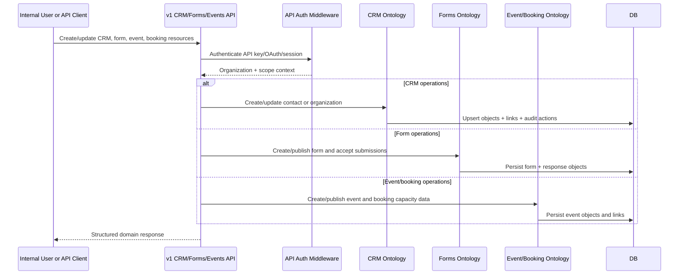

# F8 - CRM, Forms, Events, and Booking Lifecycle

## Intent

Model customers, forms, events, and bookings as linked ontology objects so capture, registration, and event operations run in one domain graph.

## Entry points

- `convex/api/v1/crm.ts`
- `convex/api/v1/forms.ts`
- `convex/api/v1/events.ts`
- `convex/api/v1/bookings.ts`

## Primary anchors

- `convex/crmOntology.ts`
- `convex/formsOntology.ts`
- `convex/eventOntology.ts`
- `convex/bookingOntology.ts`
- `convex/ticketOntology.ts`

## Sequence

## Invariants

1. Domain objects remain organization-scoped with explicit subtype/status workflows.
2. Form/event/CRM relationships are represented via object links, not implicit joins.
3. Public submission paths must only expose published/allowed resources.
