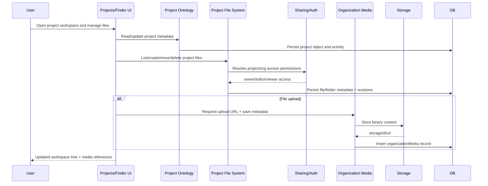

# F9 - Projects, Files, Media, and Collaboration

## Intent

Provide a shared project workspace with scoped file operations, media storage, and collaboration access controls.

## Entry points

- `convex/api/v1/projects.ts`
- Finder/project drawer UI surfaces under `src/components/window-content/finder-window/*`
- Media UI under `src/app/media/*`

## Primary anchors

- `convex/projectOntology.ts`
- `convex/projectFileSystem.ts`
- `convex/projectSharing.ts`
- `convex/projectDrawerAuth.ts`
- `convex/organizationMedia.ts`

## Sequence

## Invariants

1. File operations must enforce project-share permissions before writes.
2. Org-level and project-level file scopes must remain isolated.
3. Storage quota enforcement must happen before upload URL issuance.
