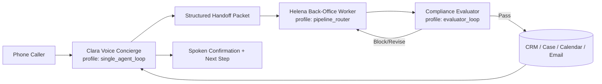

# Legal Front Office Agent Architecture Master Plan

**Workstream root:** `/Users/foundbrand_001/Development/vc83-com/docs/reference_docs/topic_collections/implementation/legal-front-office-agent-architecture`  
**Last updated:** 2026-03-26  
**Source analysis:** `/Users/foundbrand_001/Development/vc83-com/convex/ai/agents/ARCHITECTURE_REALITY_ANALYSIS_2026-03-26.md`

---

## Objective

Implement the production architecture for legal front-office operations using explicit topology contracts and deterministic fail-closed execution:

1. `Clara` as voice concierge (`single_agent_loop`).
2. `Helena` as separate back-office worker (`pipeline_router`).
3. Compliance evaluator gate (`evaluator_loop`) before external commitments.
4. `Quinn` kept onboarding-focused and not overloaded with legal back-office execution.

---

## Current codebase reality summary

1. Runtime module folders exist for `der_terminmacher`, `samantha`, and `david_ogilvy`.
2. Quinn/Mother is seeded and operational but not yet represented as a dedicated module folder.
3. Many seeded templates still rely on topology inference instead of explicit `runtimeTopologyProfile` + `runtimeTopologyAdapter` declarations.
4. ElevenLabs catalog contains a wider roster than current platform deployment defaults.
5. Compliance control plane and policy gates already provide strong fail-closed building blocks.

---

## Target state

Required architecture properties:

1. Explicit topology declaration for all critical templates and runtime modules.
2. Strict role separation between caller dialog and operational execution.
3. Fail-closed compliance gate semantics.
4. Org isolation and auditable evidence semantics preserved.

---

## Implementation phases

### Phase 1: Contract and module foundations (`LFA-001`..`LFA-004`)

1. Finalize architecture docs as canonical source-of-truth.
2. Add explicit topology declarations in seeded templates.
3. Extract Quinn onboarding module scaffold.
4. Add Helena module scaffold and module-registry wiring.

### Phase 2: Legal runtime flow (`LFA-005`..`LFA-006`)

1. Introduce strict structured handoff packet schema.
2. Implement Clara -> Helena runtime handoff.
3. Gate Helena action path through compliance evaluator before external commitments.

### Phase 3: Roster governance (`LFA-007`..`LFA-008`)

1. Add active/inactive lifecycle governance for ElevenLabs roster.
2. Preserve specialist team assets as inactive-by-default.
3. Clarify Veronica boundary and deployment intent.
4. Keep Veronica on the separate-line receptionist boundary unless explicitly promoted by a dedicated rollout decision.

### Phase 4: Validation and rollout hardening (`LFA-009`..`LFA-010`)

1. Create synthetic legal test-org fixture package.
2. Add repeatable regression matrix for legal critical path.
3. Synchronize runbook and docs CI evidence artifacts.

---

## Verification contract

All row-level verify commands must run exactly as listed in `TASK_QUEUE.md`. Global baseline profiles:

1. `npm run docs:guard`
2. `npm run typecheck`
3. Targeted unit suites per lane (`ai`, `compliance`, `telephony`)

## Regression matrix and rollout checks (`LFA-010`)

### Regression scenario matrix

| Scenario ID | Intake path | Commitment signal | Evaluator posture | Expected decision |
|---|---|---|---|---|
| `urgent_callback_commitment` | `Clara -> Helena` | booking/callback confirmation | unavailable | `blocked` (fail-closed) |
| `outbound_confirmation_with_blockers` | `Clara -> Helena` | outbound confirmation email/booking | `NO_GO` | `blocked` (fail-closed) |
| `informational_intake_only` | `Clara -> Helena` | no outward commitment | any | `passed` (`no_gate_required`) |

### Rollout check sequence

1. `npm run typecheck`
2. `npm run test:unit`
3. `npm run docs:guard`
4. Confirm audit payload includes legal-front-office gate decision metadata.
5. Confirm response payload includes legal-front-office gate decision metadata for operator observability.

## Veronica boundary contract (`LFA-008`)

1. Clara remains the public legal/demo entrypoint and specialist router.
2. Veronica remains an adjacent receptionist runtime on a separate office line.
3. Default landing-demo transfer maps exclude Veronica from Clara specialist routing.
4. Any Veronica promotion into Clara demo/legal flows requires explicit queue-task approval and docs/test updates.

---

## Risks and mitigations

1. Risk: behavior drift while extracting Quinn/Helena modules.  
Mitigation: additive extraction first, parity characterization tests, no behavior change in initial scaffolds.

2. Risk: implicit topology inference causes nondeterministic behavior.  
Mitigation: explicit profile+adapter declarations for protected templates and critical workers.

3. Risk: legal flow overpromises without compliance clearance.  
Mitigation: enforce compliance evaluator gate before any outward commitment confirmation.

4. Risk: specialist-team cleanup deletes useful assets.  
Mitigation: lifecycle `inactive` status, preserve all prompts/workflows/tests, disable by default only.

5. Risk: synthetic test data does not reflect legal reality.  
Mitigation: scenario library includes urgency, deadlines, callback, booking, and conflict variants with structured acceptance criteria.

---

## Exit criteria

1. Clara -> Helena -> Compliance path is implemented and verified.
2. Quinn remains onboarding-only and architecturally separated from Helena.
3. Topology declarations are explicit for critical templates/modules.
4. ElevenLabs roster lifecycle governance is deterministic and documented.
5. Synthetic legal-org regression suite exists and passes required verify gates.

---

## Current execution snapshot

1. Active row: `none` (queue complete).
2. Deterministic next row: `none` (all rows `DONE`).
3. Queue status: complete.
4. Completed rows: `LFA-001`, `LFA-002`, `LFA-003`, `LFA-004`, `LFA-005`, `LFA-006`, `LFA-007`, `LFA-008`, `LFA-009`, `LFA-010`.

## Execution progress log

1. 2026-03-26: `LFA-001` completed.
2. Files changed: `convex/ai/agents/ARCHITECTURE_REALITY_ANALYSIS_2026-03-26.md`, `convex/ai/agents/TOPOLOGY_GUIDE.md`, `convex/ai/agents/ARCHITECTURE.md`.
3. Verify results: `npm run docs:guard` passed.
4. Dependency promotions: `LFA-005` promoted from `PENDING` to `READY`.
5. Next deterministic row: `LFA-002`.
6. 2026-03-26: `LFA-002` completed.
7. Files changed: `convex/onboarding/seedPlatformAgents.ts`, `convex/ai/agentExecution.ts`, `tests/unit/ai/orgActionRuntimeTopologyContract.test.ts`.
8. Verify results: `npm run typecheck` passed; `npm run test:unit -- tests/unit/ai/orgActionRuntimeTopologyContract.test.ts` passed (8/8); `npm run docs:guard` passed.
9. Dependency promotions: `LFA-003` promoted from `PENDING` to `READY`.
10. Next deterministic row: `LFA-003`.
11. 2026-03-26: `LFA-003` completed.
12. Files changed: `convex/ai/agents/quinn/runtimeModule.ts`, `convex/ai/agents/quinn/prompt.ts`, `convex/ai/agents/runtimeModuleRegistry.ts`, `convex/ai/agentExecution.ts`, `tests/unit/ai/runtimeModuleRegistry.test.ts`.
13. Verify results: `npm run typecheck` passed; `npm run test:unit -- tests/unit/ai/runtimeModuleRegistry.test.ts tests/unit/ai/agentExecutionHotspotCharacterization.test.ts` passed (12/12); `npm run docs:guard` passed.
14. Dependency promotions: `LFA-004` promoted from `PENDING` to `READY`.
15. Next deterministic row: `LFA-004`.
16. 2026-03-26: `LFA-004` completed.
17. Files changed: `convex/ai/agents/helena/runtimeModule.ts`, `convex/ai/agents/helena/prompt.ts`, `convex/ai/agents/runtimeModuleRegistry.ts`, `convex/ai/agentSpecRegistry.ts`, `convex/ai/agentExecution.ts`, `tests/unit/ai/runtimeModuleRegistry.test.ts`, `tests/unit/ai/agentSpecRegistry.contract.test.ts`.
18. Verify results: `npm run typecheck` passed; `npm run test:unit -- tests/unit/ai/runtimeModuleRegistry.test.ts tests/unit/ai/agentSpecRegistry.contract.test.ts` passed (20/20); `npm run docs:guard` passed.
19. Dependency promotions: none.
20. Next deterministic row: `LFA-005`.
21. 2026-03-26: `LFA-005` completed.
22. Files changed: `convex/schemas/aiSchemas.ts`, `convex/ai/agentExecution.ts`, `tests/unit/ai/agentExecutionVoiceRuntime.test.ts`.
23. Verify results: `npm run typecheck` passed; `npm run test:unit -- tests/unit/ai/agentExecutionVoiceRuntime.test.ts tests/unit/ai/telephonyWebhookCompatibilityBridge.test.ts` passed (24/24); `npm run docs:guard` passed.
24. Dependency promotions: `LFA-006` promoted from `PENDING` to `READY`.
25. Next deterministic row: `LFA-006`.
26. 2026-03-26: `LFA-006` completed.
27. Files changed: `convex/ai/agentExecution.ts`, `convex/ai/orgActionPolicy.ts`, `convex/complianceControlPlane.ts`, `tests/unit/ai/agentExecutionVoiceRuntime.test.ts`, `tests/unit/compliance/complianceShadowModeEvaluator.test.ts`.
28. Verify results: `npm run typecheck` passed; `npm run test:unit -- tests/unit/compliance/complianceShadowModeEvaluator.test.ts tests/unit/ai/agentExecutionVoiceRuntime.test.ts` passed (26/26); `npm run docs:guard` passed.
29. Dependency promotions: `LFA-007` promoted from `PENDING` to `READY`; `LFA-009` promoted from `PENDING` to `READY`; deterministic pick advanced `LFA-009` from `READY` to `IN_PROGRESS`.
30. Next deterministic row: `LFA-009`.
31. 2026-03-26: `LFA-009` completed.
32. Files changed: `tests/fixtures/legal-front-office-synthetic-org.ts`, `tests/unit/ai/agentExecutionVoiceRuntime.test.ts`, `tests/unit/compliance/complianceShadowModeEvaluator.test.ts`.
33. Verify results: `npm run typecheck` passed; `npm run test:unit -- tests/unit/ai/agentExecutionVoiceRuntime.test.ts tests/unit/compliance/complianceShadowModeEvaluator.test.ts` passed (27/27); `npm run docs:guard` passed.
34. Dependency promotions: `LFA-010` promoted from `PENDING` to `READY`; deterministic pick advanced `LFA-010` from `READY` to `IN_PROGRESS`.
35. Next deterministic row: `LFA-010`.
36. 2026-03-26: `LFA-010` completed.
37. Files changed: `tests/unit/ai/agentExecutionVoiceRuntime.test.ts`, `tests/unit/compliance/complianceShadowModeEvaluator.test.ts`, `docs/reference_docs/topic_collections/implementation/legal-front-office-agent-architecture/INDEX.md`, `docs/reference_docs/topic_collections/implementation/legal-front-office-agent-architecture/MASTER_PLAN.md`.
38. Verify results: `npm run typecheck` passed; `npm run test:unit` passed (428 files, 2258 tests); `npm run docs:guard` passed.
39. Dependency promotions: none (all `P0` rows complete).
40. Next deterministic row: `LFA-007` (`READY` -> `IN_PROGRESS`).
41. 2026-03-26: `LFA-007` completed.
42. Files changed: `scripts/ai/elevenlabs/lib/catalog.ts`, `scripts/ai/elevenlabs/sync-elevenlabs-agent.ts`, `scripts/ai/elevenlabs/README.md`.
43. Verify results: `npm run typecheck` passed; `npm run test:unit -- tests/unit/telephony/telephonyIntegration.test.ts` passed (10/10); `npm run docs:guard` passed.
44. Dependency promotions: `LFA-008` promoted from `PENDING` to `READY`; deterministic pick advanced `LFA-008` from `READY` to `IN_PROGRESS`.
45. Next deterministic row: `LFA-008`.
46. 2026-03-26: `LFA-008` completed.
47. Files changed: `convex/ai/agents/elevenlabs/landing-demo-agents/README.md`, `scripts/ai/elevenlabs/lib/catalog.ts`, `docs/reference_docs/topic_collections/implementation/legal-front-office-agent-architecture/MASTER_PLAN.md`.
48. Verify results: `npm run docs:guard` passed; `npm run typecheck` passed.
49. Dependency promotions: none (queue terminal).
50. Next deterministic row: none (all rows complete).
