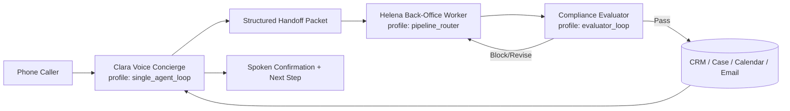

# Legal Front Office Agent Architecture Master Plan

**Workstream root:** `/Users/foundbrand_001/Development/vc83-com/docs/reference_docs/topic_collections/implementation/legal-front-office-agent-architecture`  
**Last updated:** 2026-03-26  
**Source analysis:** `/Users/foundbrand_001/Development/vc83-com/convex/ai/agents/ARCHITECTURE_REALITY_ANALYSIS_2026-03-26.md`

---

## Objective

Implement the production architecture for legal front-office operations using explicit topology contracts and deterministic fail-closed execution:

1. `Clara` as voice concierge (`single_agent_loop`).
2. `Helena` as separate back-office worker (`pipeline_router`).
3. Compliance evaluator gate (`evaluator_loop`) before external commitments.
4. `Quinn` kept onboarding-focused and not overloaded with legal back-office execution.

---

## Current codebase reality summary

1. Runtime module folders exist for `der_terminmacher`, `samantha`, and `david_ogilvy`.
2. Quinn/Mother is seeded and operational but not yet represented as a dedicated module folder.
3. Many seeded templates still rely on topology inference instead of explicit `runtimeTopologyProfile` + `runtimeTopologyAdapter` declarations.
4. ElevenLabs catalog contains a wider roster than current platform deployment defaults.
5. Compliance control plane and policy gates already provide strong fail-closed building blocks.

---

## Target state

Required architecture properties:

1. Explicit topology declaration for all critical templates and runtime modules.
2. Strict role separation between caller dialog and operational execution.
3. Fail-closed compliance gate semantics.
4. Org isolation and auditable evidence semantics preserved.

---

## Implementation phases

### Phase 1: Contract and module foundations (`LFA-001`..`LFA-004`)

1. Finalize architecture docs as canonical source-of-truth.
2. Add explicit topology declarations in seeded templates.
3. Extract Quinn onboarding module scaffold.
4. Add Helena module scaffold and module-registry wiring.

### Phase 2: Legal runtime flow (`LFA-005`..`LFA-006`)

1. Introduce strict structured handoff packet schema.
2. Implement Clara -> Helena runtime handoff.
3. Gate Helena action path through compliance evaluator before external commitments.

### Phase 3: Roster governance (`LFA-007`..`LFA-008`)

1. Add active/inactive lifecycle governance for ElevenLabs roster.
2. Preserve specialist team assets as inactive-by-default.
3. Clarify Veronica boundary and deployment intent.

### Phase 4: Validation and rollout hardening (`LFA-009`..`LFA-010`)

1. Create synthetic legal test-org fixture package.
2. Add repeatable regression matrix for legal critical path.
3. Synchronize runbook and docs CI evidence artifacts.

---

## Verification contract

All row-level verify commands must run exactly as listed in `TASK_QUEUE.md`. Global baseline profiles:

1. `npm run docs:guard`
2. `npm run typecheck`
3. Targeted unit suites per lane (`ai`, `compliance`, `telephony`)

---

## Risks and mitigations

1. Risk: behavior drift while extracting Quinn/Helena modules.  
Mitigation: additive extraction first, parity characterization tests, no behavior change in initial scaffolds.

2. Risk: implicit topology inference causes nondeterministic behavior.  
Mitigation: explicit profile+adapter declarations for protected templates and critical workers.

3. Risk: legal flow overpromises without compliance clearance.  
Mitigation: enforce compliance evaluator gate before any outward commitment confirmation.

4. Risk: specialist-team cleanup deletes useful assets.  
Mitigation: lifecycle `inactive` status, preserve all prompts/workflows/tests, disable by default only.

5. Risk: synthetic test data does not reflect legal reality.  
Mitigation: scenario library includes urgency, deadlines, callback, booking, and conflict variants with structured acceptance criteria.

---

## Exit criteria

1. Clara -> Helena -> Compliance path is implemented and verified.
2. Quinn remains onboarding-only and architecturally separated from Helena.
3. Topology declarations are explicit for critical templates/modules.
4. ElevenLabs roster lifecycle governance is deterministic and documented.
5. Synthetic legal-org regression suite exists and passes required verify gates.

---

## Current execution snapshot

1. Active row: none.
2. Deterministic next row: `LFA-001`.
3. Queue status: initialized for execution.
